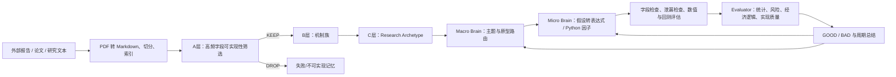

# Agent Alpha

> Monorepo note: this repository is the shared source-control home for Agent
> Alpha, Paper Graph, and Paper Digest New2.  Agent Alpha remains at the
> repository root for backward compatibility; the other projects live in
> `paper-graph/` and `paper-digest-new2/`.  Large datasets, logs, generated
> reports, caches, virtual environments, and model artifacts remain local and
> are intentionally excluded from Git.

Agent Alpha 是一个面向量化交易论文阅读、Alpha 信号生成、Alpha 因子挖掘与评估的多智能体项目，实现高频因子的挖掘。当前阶段设计三部分：

1. Alpha 信号生成
2. Alpha 因子挖掘
3. Alpha 研究评估与质量检测

这三部分也可以理解为 Alpha 研究自动化中的三个角色：

```text
The Idea Person
   提出投资概念、市场假设、finance intuition 和 alpha signal。

The Implementer
   将研究想法转化为可计算表达式、可执行代码、因子值和回测实验。

The Evaluator
   用统计显著性、风险评估、经济逻辑和实现质量标准判断研究是否真正有效。
```

## 1. 项目目标

项目目标是让 LLM 阅读量化交易相关论文，提取论文中的市场机制、交易直觉和可研究信号，再将这些信号转化为表达式形式的 Alpha 因子，并通过计算、回测、搜索增强和 Alpha 库维护形成持续迭代流程。

这里需要区分三类产物：

```text
论文理解 Reading Note
  只描述论文主要内容、证据、机制、结论和局限，不直接写因子。

金融直觉 / Alpha Signal
  从论文理解中抽象出可能有交易价值的市场直觉、信号方向和代理变量。

表达式 Alpha Factor
  将信号转化为可计算表达式，并配置数据字段、窗口、方向、频率和评估方式。
```

## 2. 参考项目与来源

| 来源项目 | 在 Agent Alpha 中的作用 | 主要参考内容 |
|---|---|---|
| `my-paper-digest-new2` | 论文来源、论文抓取、论文解析、论文阅读、证据抽取 | `config/sources.yaml`、`src/io/http.py`、`src/arxiv/`、reading note / factor generation 相关流程 |
| `RD-Agent` | 从研究报告或论文内容生成因子的 agent/workflow 思路 | factor_from_report 相关流程、研究内容到可执行因子的转换思路 |
| `CogAlpha_Prompt` | 因子生成提示词、7 层 21 个专职生成方向、候选池、思维进化；本项目保留其“专职角色/prompt”思想，并改造成高频机制角色 | `assets/overview.png`、`prompts/seven_level_agent_hierarchy/`、`prompts/thinking_evolution/` |
| `fac-eval-demo` | 因子计算、评估、回测、结果存储、基础质量检验 | `py_eval/runner.py`、`py_eval/factor_loader.py`、`py_eval/metrics.py`、`py_eval/storage.py` |
| Alpha-GPT 思路 | 层级 RAG：从历史 Alpha、数据类别、字段检索到生成因子 | 通用 AlphaBot 根据字段和元数据生成 Alpha，不固定一类一个 Agent |
| XALPHA 思路 | 仅保留“外部文献吸收到结构化研究记忆”的思路 | 不再采用 XALPHA 日频 B/C taxonomy 作为高频因子的主分类 |

## 3. 总体设计选择

本项目不采用“一个信号只能分到一个固定类别 Agent”的硬分类。

原因：

1. 一篇论文或一个信号经常同时涉及多个机制，例如量价背离、波动状态、流动性冲击和反转。
2. Alpha-GPT 表明，因子生成可以先通过层级 RAG 找字段和历史 Alpha，再由通用生成器生成表达式。
3. 高频因子关注 30s 到 30min 的短周期有效性，核心机制更接近盘口压力、短期量价冲击、微观流动性、短期反转、波动突变和订单簿结构。
4. CogAlpha 的 21 个 Agent 更适合作为“专职提示词能力库”，可以被改写为高频机制角色。
5. XALPHA 的 B/C 层主要面向日频 OHLCV 研究原型，不作为本项目主分类；其 A/B/C 记忆吸收流程可保留为文献记忆结构。

因此 Agent Alpha 采用以下折中方案：

```text
多层级标签 + 层级 RAG + 动态 Agent 组装
```

一个 signal 可以同时拥有多个标签：

```text
signal
   -> data_tags: tick_bar, order_book, trade_flow, short_horizon_return
   -> hf_mechanism_tags: order_imbalance, liquidity_pressure, spread_reversion, volume_shock
   -> cogalpha_roles: AgentOrderImbalance, AgentLiquidity, AgentPriceVolumeCoherence
   -> candidate_fields: close, volume, money, askP1, bidP1, askV1, bidV1, ret30s, ret120s
  -> runtime_agents: 本轮真正调用的 3-8 个 agent/prompt
```

最终不是“这个信号属于某一层”，而是“这个信号有哪些数据来源、机制解释、可用字段、适合哪些生成角色”。

## 4. Agent Alpha 分层

Agent Alpha 明确分为 8 层。这里的“层”不是互斥分类，而是从论文到因子的逐步抽象。

```text
L0. Paper Source Layer
L1. Paper Understanding Layer
L2. Signal Abstraction Layer
L3. Evidence / Data Field RAG Layer
L4. Mechanism Taxonomy Layer
L5. Runtime Factor Agent Layer
L6. Factor Evaluation & Alpha Library Layer
L7. Research Quality Review Layer
```

### L0：Paper Source Layer

负责选择和抓取论文。

这一层先做轻量 metadata 过滤，再决定是否写入 raw 记录或下载真实 PDF / HTML 全文。过滤条件参考 `my-paper-digest-new2/config/sources.yaml` 的来源设计，但面向 Agent Alpha 的 30s 到 30min 高频目标增加限制：标题、摘要或 URL 必须包含高频、日内、盘口、订单簿、微观结构、流动性、价差、成交量等相关线索；纯基本面、财报、宏观、分析师或新闻情绪文本默认不进入全文抓取。

数据来源：

- `my-paper-digest-new2/config/sources.yaml`
- arXiv API / arXiv HTML / PDF
- RSS、网页、手动维护的论文列表
- 后续可接入本地 PDF、研究报告、博客和研报数据库

核心产物：

```text
data/raw_papers/
```

### L1：Paper Understanding Layer

负责让 LLM 阅读论文，输出结构化 reading note。

注意：这一层的目标是理解论文，不是实现因子。

Reading note 会保留 `supporting_evidence`、`score_dimensions` 和 `recommendation_score`。后续进入信号生成前必须先经过 reading gate：如果证据不足、机制链过短、没有可能交易直觉，或评分低于阈值，则停止在 reading note 阶段，不发送给 The Idea Person / signal 处理。

核心产物：

```text
data/parsed_papers/
data/reading_notes/
```

### L2：Signal Abstraction Layer

负责从 reading note 中提取 finance intuition / alpha signal。

这一层生成的是自然语言信号，例如：

```text
成交量异常放大但价格未同步上涨，可能表示卖压吸收或资金分歧，后续存在反转或突破机会。
```

核心产物：

```text
data/signals/
```

### L3：Evidence / Data Field RAG Layer

负责把 signal 连接到可用数据字段、历史 Alpha、已有表达式、数据类别和代理变量。

这一层借鉴 Alpha-GPT：

```text
历史 Alpha / 元数据
  -> 高层数据类别
  -> 二级数据类别
  -> 具体字段
  -> LLM 根据字段生成 Alpha
```

本项目不会强行列出所有数据类别和字段，因为真实字段依赖数据供应商和本地数据表。README 中只定义接口和存储方式。

核心产物：

```text
data/field_rag/
data/alpha_metadata/
```

### L4：Mechanism Taxonomy Layer

负责给 signal 打上机制标签。一个 signal 可以同时属于多个机制族和多个研究原型。

这一层以高频机制标签为主，同时参考 CogAlpha 的专职角色思想：

- CogAlpha 提供 7 层 21 个专职生成方向，可改造成高频生成角色。
- XALPHA 的日频 B/C 分类不作为主分类，只作为文献记忆吸收流程的历史参考。
- 主分类改为 30s 到 30min 高频机制 taxonomy。

核心产物：

```text
data/signals/tagged_signals/
```

### L5：Runtime Factor Agent Layer

负责根据 signal、字段、机制标签和历史反馈，动态选择若干 Agent / Prompt 来生成表达式因子。

这不是固定 21 个 Agent 同时运行，也不是 48 个 C 类各启动一个 Agent。

建议规则：

```text
每个 signal 至少选择 1 个主机制 Agent
每个 signal 可选择 1-4 个辅助机制 Agent
每轮实验可动态组装 3-8 个运行时 Agent
每个 Agent 可以生成多个表达式候选
```

核心产物：

```text
data/factors/raw_expressions/
outputs/factor_runs/
```

### L6：Factor Evaluation & Alpha Library Layer

负责计算 Alpha、回测评估、搜索增强、维护候选池和 Alpha 库。

核心产物：

```text
outputs/search_runs/
outputs/alpha_library/
```

### L7：Research Quality Review Layer

负责对 Alpha 研究做严格评估，判断一个候选因子是否只是数学表达式上成立，还是同时具备统计显著性、风险稳健性、经济逻辑和可实现性。

这一层对应 The Evaluator。

核心产物：

```text
outputs/evaluation_runs/
outputs/review_reports/
```

## 5. 项目结构

当前项目已经进入可运行骨架阶段。下面是当前实际结构和仍保留的规划目录说明。

```text
agent_alpha/
├── README.md
├── pyproject.toml
├── configs/
│   ├── paper_sources.yaml
│   ├── llm.yaml
│   ├── market_data.yaml
│   ├── field_registry.yaml
│   ├── mcp_tools.yaml
│   ├── skill_registry.yaml
│   ├── signal_generation.yaml
│   ├── mechanism_taxonomy.yaml
│   ├── factor_mining.yaml
│   ├── backtest.yaml
│   ├── quality_evaluation.yaml
│   └── alpha_library.yaml
├── data/
│   ├── raw_papers/
│   ├── parsed_papers/
│   ├── reading_notes/
│   ├── signals/
│   ├── market_data/
│   ├── field_rag/
│   ├── document_chunks/
│   ├── rma_records/
│   ├── archetype_memory/
│   ├── alpha_metadata/
│   ├── factor_registry/
│   ├── evaluation_records/
│   ├── feedback_memory/
│   ├── factors/
│   └── backtest_results/
├── skills/
│   ├── paper_to_signal/SKILL.md
│   ├── signal_to_factor/SKILL.md
│   ├── factor_evaluation/SKILL.md
│   └── memory_absorption/SKILL.md
├── mcp/
│   ├── README.md
│   └── tools.yaml
├── prompts/
│   ├── paper_reading/
│   ├── signal_generation/
│   ├── factor_expression/
│   ├── hf_mechanism_agents/
│   └── shared/
├── src/
│   └── agent_alpha/
│       ├── agents/
│       ├── backtest/
│       ├── data_interfaces/        # compatibility wrappers only
│       ├── evaluation/
│       ├── factors/
│       ├── library/
│       ├── llm/
│       ├── mcp_tools/
│       ├── memory/
│       ├── paper/
│       ├── reading/
│       ├── rag/
│       ├── search/
│       ├── signals/
│       ├── skills/
│       ├── taxonomy/
│       └── workflows/
├── examples/
│   └── fac_eval_factor_template.py
├── docs/
│   ├── env.md
│   ├── field_stage_plan.md
│   └── crawler_handoff.md
├── tests/
└── outputs/
```

当前仍属于兼容或临时 baseline 的文件：

```text
src/agent_alpha/data_interfaces/*
   只保留旧 import 兼容，真实实现已移到 factors/。

src/agent_alpha/factors/expression_generator.py
   只保留旧 import 兼容，内部调用 template_factor_generator.py，迁移完成后删除。

src/agent_alpha/factors/template_factor_generator.py
   非 LLM baseline，仅用于 smoke test / 无 API key 调试，最终删除或移动到 tests/fixtures。

src/agent_alpha/reading/extractive_paper_reader.py
   抽取式 fallback，可长期保留作无 API key demo，但不是最终 LLM reading 主路径。
```

## 5.1 当前进展总览

当前已经完成并通过测试的能力：

```text
本地文档摄取 -> parsed paper -> document chunks -> extractive / LLM reading_note_v1 -> RMA records
AI-1 LLM paper reader：document chunks -> prompt_runner -> reading_note_v1 -> reading_gate，fake LLM 测试已覆盖
new2-style chunked reading：parser 先读取 PDF/LaTeX/source 包生成 chunks，再构建 evidence_pack_v2，按 overview/formula/method-results/experimental/conclusion 任务分组，可选 map-merge 分部阅读，避免全文直接塞进一次 LLM 调用
reading gate：低分、无证据、无交易直觉、机制链过短时停止
LLM signal generator：要求输出 {"signals": [...]}, 并过滤非法机制标签和字段
LLM factor generator：要求输出 FactorCandidate JSON，不允许 Python 代码
prompt context builder：为 signal/factor LLM 注入 Skill、shared constraints、mechanism prompts、GOOD/BAD/REVISE memory
ASL prefix_expression：支持结构化前序表达、字段/窗口提取、ASL 校验和字符串兼容转换
FactorCandidate -> validator -> renderer -> py_compile -> fac-eval config
本地 JSONL memory store：factor registry、evaluation records、feedback memory、alpha library
CandidatePool：去重、状态、generation、parent lineage
LLM-led signal_mutation / factor_mutation agents：变异 signal idea 或 factor idea，不做机械公式调参
batch factor iteration：从大批 signals JSON 批量生成初始 FactorCandidate，并按 generation 调用 LLM factor mutation 迭代
Evaluator：implementation/statistical/risk/economic checks -> accept/revise/reject
AI-5 iteration workflow：render、compile、fac-eval config、可选 fac-eval run、metrics 回填、review、feedback、alpha admission、next candidates
```

当前验证状态：

```text
python -m py_compile $(find src tests examples -name '*.py')
pytest -q

当前测试数量：86 passed

真实 LLM smoke：`High-Frequency Trading Synchronizes Prices in Financial Markets` 已用 new2-style evidence_pack_v2 / chunked reading 重新跑通，reading_gate 通过，生成 3 个 AlphaSignal，输出位于 `outputs/real_e2e/hft_synchronizes_prices_1211_1919/llm_signals_rerun.json`。
```

当前 baseline：

```text
reading fallback:
   extractive_paper_reader.py
   用于无 API key demo、本地 ingestion 测试和 LLM 失败时的人类可读兜底。

reading main path:
   llm_paper_reader.py
   已实现 fake LLM 测试；真实 API 调用通过 LLMClient/prompt_runner 接入。

factor baseline:
   template_factor_generator.py
   仅在 --baseline-template 时使用，用于 smoke test。

compatibility wrapper:
   expression_generator.py
   旧 import 兼容层，最终删除。
```

当前主要缺口：

```text
真实 API key e2e 需要在短论文上实测 LLM reading / signal / factor 三段 JSON 稳定性。
--run-fac-eval 已支持调用和 metrics 路径推断，但还需要用真实 fac-eval-demo 数据跑通生产参数。
alpha_library 仍是最小 admission，还缺版本、去重、状态流转和部署 registry。
data_interfaces/ 与 expression_generator.py 是兼容冗余层，迁移完成后可删。
template_factor_generator.py 仍是 baseline/fallback，不应作为最终 Implementer。
```

## 6. 文件与目录职责说明

本节分为当前已存在文件和规划待实现文件。当前实现表只描述仓库里已经存在并有测试覆盖的文件；规划项会单独列出，避免把未来模块误读成已经落地。

### 6.1 根目录

| 路径 | 职责 | 数据来源 / 输入 | 输出 |
|---|---|---|---|
| `README.md` | 项目设计文档，说明目标、分层、数据来源、目录结构和每个文件职责 | 用户需求、四个参考项目、Alpha-GPT / CogAlpha / 高频因子设计思路 | 项目结构说明 |

### 6.2 `configs/`

| 文件 | 职责 | 数据来源 / 输入 | 输出 / 被谁使用 |
|---|---|---|---|
| `configs/paper_sources.yaml` | 配置论文来源、抓取前 relevance gate、是否下载全文，包括 arXiv、RSS、网页、本地 PDF、研究报告目录 | 参考 `my-paper-digest-new2/config/sources.yaml`、高频关键词、排除词、来源类型和年龄限制 | `paper/source_loader.py` 读取后传给抓取模块，`paper/relevance_filter.py` 决定是否抓取真实文件 |
| `configs/llm.yaml` | 配置通过 API key 调用的 LLM provider、模型名、温度、最大 token、重试策略、并发限制和角色分配 | 本地环境变量中的 API key、实验设置、不同 LLM 角色配置 | `llm/client.py`、`reading/llm_paper_reader.py`、`signals/llm_signal_generator.py`、`factors/llm_factor_generator.py` 使用 |
| `configs/market_data.yaml` | 配置 fac-eval-demo 所需的高频市场数据路径、时间列和默认 horizon | 本地行情库、fac-eval-demo 数据约定 | `factors/fac_eval_contract.py`、`factors/fac_eval_adapter.py`、`backtest/evaluator.py` 使用 |
| `configs/field_registry.yaml` | 注册具体字段、字段含义、频率、单位、可用范围、缺失值规则；本项目公式字段白名单以高频行情、盘口、成交和短周期收益字段为主 | 数据供应商字段表、本地数据 schema、Alpha-GPT 式字段层级 | `rag/field_retriever.py`、`factors/expression_validator.py` 使用 |
| `configs/mcp_tools.yaml` | 配置 MCP 风格工具接口，定义 LLM 可调用的数据查询、记忆检索、因子注册和评估查询工具 | 本地 MCP server、工具 schema、权限设置 | `mcp_tools/*`、runtime agents 使用 |
| `configs/skill_registry.yaml` | 注册 Skill 风格工作流，例如 paper_to_signal、signal_to_factor、factor_evaluation、memory_absorption | `skills/*/SKILL.md` | workflow router 和 agent selector 使用 |
| `configs/signal_generation.yaml` | 配置信号生成规则，例如每篇论文最多生成几个 signal、reading gate 评分维度和过滤阈值 | reading note、LLM prompt 参数 | `signals/reading_gate.py`、`signals/llm_signal_generator.py`、`signals/signal_ranker.py` 使用 |
| `configs/mechanism_taxonomy.yaml` | 配置高频机制标签体系，包含短周期量价、盘口压力、流动性、价差、成交冲击、短期反转和波动突变等标签；CogAlpha 只作为角色/prompt 参考 | 高频字段、`CogAlpha_Prompt`、人工维护映射 | `taxonomy/mechanism_tagger.py` 使用 |
| `configs/factor_mining.yaml` | 当前只配置 baseline / fallback 表达式模板；最终 LLM Implementer 稳定后应删除或降级为测试 fixture | 数据字段、表达式 DSL、实验约束 | 仅 `--baseline-template` 时由 `factors/template_factor_generator.py` 使用，默认由 LLM Implementer 替代 |
| `configs/backtest.yaml` | 配置回测与评估参数，例如 universe、rebalance、成本、IC 窗口、分组数 | 市场数据、因子值、收益数据 | `backtest/evaluator.py`、`backtest/metrics.py` 使用 |
| `configs/quality_evaluation.yaml` | 配置研究质量检测标准，例如统计显著性阈值、风险暴露限制、经济逻辑检查项、代码质量检查项 | 回测结果、因子表达式、实现代码、研究假设 | `evaluation/research_evaluator.py` 使用 |
| `configs/alpha_library.yaml` | 配置 Alpha 入库标准、标签、版本策略、状态流转 | 回测结果、因子元数据、人工审核结果 | `library/alpha_library.py` 使用 |

### 6.3 `data/`

| 目录 | 存放内容 | 来源 | 说明 |
|---|---|---|---|
| `data/raw_papers/` | 原始论文 PDF、HTML、arXiv 元数据、摘要 | `paper_fetcher.py` 从 `paper_sources.yaml` 配置的来源抓取 | 保留原始材料，便于复现 reading note |
| `data/parsed_papers/` | 解析后的正文、章节、表格、公式、参考文献 | `paper_parser.py` 从 `raw_papers` 解析 | 给 LLM 阅读使用，尽量保留章节结构 |
| `data/reading_notes/` | LLM 或抽取式 reader 生成的论文阅读笔记 | `extractive_paper_reader.py` / `llm_paper_reader.py` 读取 `parsed_papers` 或 chunks 后生成 | 不写因子代码，只写论文内容、机制、证据、局限、评分和读后门控所需字段 |
| `data/signals/` | finance intuition / alpha signal | `llm_signal_generator.py` 从 `reading_notes` 生成 | 自然语言信号，包含证据、方向、代理变量和风险 |
| `data/market_data/` | 因子计算使用的高频数值数据，默认包含价格、成交量、成交额、委托买卖、十档盘口和 10s/30s/60s/120s 等短周期收益标签 | `fac-eval-demo` 数据、本地高频行情库 | 这是唯一进入主实验因子公式和回测计算的数据源 |
| `data/field_rag/` | 字段索引、字段说明、字段层级的规划目录 | `field_registry.yaml`、本地数据 schema | 当前尚未实现向量索引；字段硬约束由 `configs/field_registry.yaml` 和 `rag/field_registry.py` 提供 |
| `data/document_chunks/` | 外部报告、论文、研究文本切分后的 evidence chunks | PDF/Markdown parser、文档索引器 | 只作为研究记忆，不直接进入因子公式 |
| `data/rma_records/` | Report-to-Memory Absorption 结果，包括 A 层 KEEP/DROP、B 层机制族、C 层原型和证据路径 | `memory/rma_filter.py`、`memory/archetype_builder.py` | 给 Macro Brain / agent selector 检索研究路径 |
| `data/archetype_memory/` | C 层 Research Archetype 记忆，包括机制、金融含义、证据路径、实现约束、成功/失败摘要 | rma_records、实验反馈 | 给本轮研究主题和 runtime agents 提供上下文 |
| `data/alpha_metadata/` | 历史 Alpha、已有因子、因子表现、字段依赖 | `alpha_library.py`、历史实验、外部 Alpha 库 | 用于检索相似 Alpha，避免重复生成 |
| `data/factor_registry/` | 因子级记忆，包括代码、表达式、假设、字段、机制标签、父代谱系、周期和代数 | runtime agents、search pipeline | 用于溯源、变异、交叉、精炼和失败规避 |
| `data/evaluation_records/` | 评估级记忆，包括训练/验证指标、滚动样本外、相关性、复杂度、泄漏检查和保留状态 | Evaluator、backtest pipeline | 用于下一轮筛选、反馈和 Alpha 入库判断 |
| `data/feedback_memory/` | GOOD/BAD 记忆、失败类型、可复用原则、避免规则、下一轮建议主题 | Evaluator、Cross Brain、周期总结 | 用于下一轮 hypothesis 和 factor generation 的提示上下文 |
| `data/factors/` | FactorCandidate、ASL 前序表达式、兼容 DSL 字符串和渲染后的 fac-eval Python 文件 | baseline generator 或 LLM Implementer 生成 FactorCandidate，renderer 生成 Python 文件 | 只保存定义和可执行因子文件，不保存大规模回测结果 |
| `data/backtest_results/` | 回测明细、指标、分组收益、IC 序列 | `backtest/evaluator.py` 输出 | 可作为后续搜索增强和入库依据 |

### 6.4 `prompts/`

| 目录 | 职责 | 参考来源 |
|---|---|---|
| `prompts/paper_reading/reading_note_v1_system.md` | AI-1 LLM paper reader system prompt，只生成 `reading_note_v1`，禁止 signal/factor/code | `my-paper-digest-new2` reading note 流程 |
| `prompts/signal_generation/alpha_signal_v1_system.md` | The Idea Person system prompt，只生成 AlphaSignal JSON，禁止 factor/code | `paper_to_signal` skill、reading note evidence 规则 |
| `prompts/factor_expression/factor_candidate_asl_system.md` | The Implementer system prompt，只生成 FactorCandidate JSON 和 ASL `prefix_expression`，禁止 Python code | `signal_to_factor` skill、ASL/field guard 约束 |
| `prompts/hf_mechanism_agents/` | 高频机制专用生成角色提示词，例如订单失衡、价差回归、流动性冲击、短期量价背离 | 高频字段与 30s-30min 目标窗口 |
| `prompts/shared/asl_factor_candidate_output.md` | FactorCandidate / ASL 输出规范，明确不写 Python code | ASL、field guard、renderer 边界 |
| `prompts/shared/` | 高频字段、因子要求、ASL 输出格式和编码边界的共享约束文本 | Agent Alpha 字段白名单、fac-eval 约束 |

### 6.5 `skills/`

Skill 文件用于定义窄角色、固定输入、固定输出 schema 和工作流触发条件。设计上参考 `my-paper-digest-new2/.github/skills/three-ai-paper-factor/SKILL.md`。

| 文件 | 职责 | 输入 | 输出 |
|---|---|---|---|
| `skills/paper_to_signal/SKILL.md` | 定义论文阅读到 signal 生成工作流，约束 LLM 只根据 evidence 和 reading note 提出 finance intuition | article_meta、evidence_pack、parsed paper、context providers | reading_note、alpha_signal |
| `skills/signal_to_factor/SKILL.md` | 定义 signal 到表达式因子的工作流，要求先检索字段和机制记忆，再生成表达式 | alpha_signal、field candidates、archetype memory、allowed operators | factor candidates |
| `skills/factor_evaluation/SKILL.md` | 定义 Evaluator 工作流，检查统计、风险、经济逻辑和实现质量 | factor candidate、backtest result、reading note、signal | research review record |
| `skills/memory_absorption/SKILL.md` | 定义外部文献吸收到 A/B/C 研究记忆的工作流 | document chunks、高频字段白名单、taxonomy config | rma_records、archetype_memory |

### 6.6 `mcp/`

MCP 目录用于把本地数据和记忆包装成工具接口。LLM 通过 API key 调用模型，本身不应直接访问数据库或文件系统；需要通过受控 MCP/Tool 接口读取字段、记忆、因子和评估结果。

| 文件 | 职责 | 暴露的能力 | 备注 |
|---|---|---|---|
| `mcp/README.md` | 说明 MCP server 的启动方式、权限、工具 schema 和安全边界 | 文档说明 | 不存 API key |
| `mcp/tools.yaml` | 注册可被 LLM 调用的工具名、输入 schema、输出 schema、权限和速率限制 | tool registry | 与 `configs/mcp_tools.yaml` 对齐 |
| 当前状态 | 尚未实现独立 MCP server 进程；当前可用工具实现位于 `src/agent_alpha/mcp_tools/local_tools.py` | `list_fields`、`validate_factor_fields`、`render_fac_eval_file`、`write_fac_eval_config`、`search_jsonl` | 先服务本地 workflow 和测试，后续再封装成 server |

### 6.7 `src/agent_alpha/paper/`

| 文件 | 职责 | 输入 | 输出 |
|---|---|---|---|
| `source_loader.py` | 加载论文来源配置，统一转换成 source objects | `configs/paper_sources.yaml` | 标准化论文源列表 |
| `relevance_filter.py` | 抓取前判断文章是否满足高频研究限制，避免下载低相关真实文件 | RSS/arXiv/web 条目的 title、abstract、URL、source_type、published_at 和 `fetch_filter` 配置 | fetch gate decision：是否写 raw / 下载全文、命中关键词、拦截原因 |
| `paper_fetcher.py` | 按来源抓取论文元数据、摘要、HTML、PDF；RSS/arXiv/web 会先经过 relevance gate | source objects、网络接口、本地路径、fetch gate 配置 | `data/raw_papers/` |
| `paper_parser.py` | 解析 PDF/HTML/LaTeX，切分章节、表格、公式和引用 | `data/raw_papers/` | `data/parsed_papers/` |
| `paper_deduper.py` | 去重论文，合并 arXiv、网页、PDF 的重复记录 | raw metadata、title、doi、arxiv_id | 去重后的 paper index |

### 6.8 `src/agent_alpha/llm/`

| 文件 | 职责 | 输入 | 输出 |
|---|---|---|---|
| `client.py` | 统一封装 API key 形式的 LLM 调用，支持 provider、模型、超时、重试和日志 | `configs/llm.yaml`、环境变量中的 API key | LLM response |
| `schemas.py` | 定义各角色 LLM 的输入输出 schema，例如 reading_note、alpha_signal、factor_candidate、research_review | schema config | 可校验对象 |
| `prompt_runner.py` | 加载 prompt，组装 system/user messages，调用 `LLMClient.complete_json` | prompt path、JSON payload、LLM client | structured JSON response，可选 audit record |
| `audit_log.py` | 保存 LLM 输入输出的可审计 JSON，并对 API key/token/secret 做脱敏 | LLM request/response | `outputs/llm_audit/*.json` |

### 6.9 `src/agent_alpha/data_interfaces/`

这个目录不再是核心实现层，只保留向后兼容 wrapper。真实职责已经合并到 `factors/` 的 fac-eval 边界中：

| 文件 | 当前职责 | 实际实现位置 |
|---|---|---|
| `data_guard.py` | 兼容旧 import | `factors/field_guard.py` |
| `hf_feature_builder.py` | 兼容旧 import | `factors/hf_feature_builder.py` |
| `market_data_client.py` | 兼容旧 import | `factors/fac_eval_contract.py` |

后续新代码不要再依赖 `data_interfaces/`。这层最终可以在调用方全部迁移后删除。

### 6.10 `src/agent_alpha/memory/`

| 文件 | 职责 | 输入 | 输出 |
|---|---|---|---|
| `document_ingestor.py` | 将 PDF、Markdown、研究文本切分成 evidence chunks | raw documents | `data/document_chunks/` |
| `rma_filter.py` | A 层高频字段可实现性筛选，判断 chunk 是 KEEP 还是 DROP | document chunk、高频字段白名单 | A-layer decision |
| `mechanism_absorber.py` | B 层机制族抽取，将 KEEP chunk 归入宽泛机制族 | A-layer KEEP chunks、taxonomy config | B-layer memory |
| `archetype_builder.py` | C 层研究原型构建，形成 Research Archetype 记录 | B-layer memory、evidence path | `data/archetype_memory/` |
| `jsonl_store.py` | 通用 JSONL store，支持 append/load/search/filter | record dict、store config | JSONL records |
| `evaluation_store.py` | evaluation record JSONL 写入封装 | evaluator output | `data/evaluation_records/` 或 run-local records |
| `feedback_memory.py` | GOOD/BAD/REVISE feedback memory store | evaluator feedback | feedback JSONL |
| `experiment_memory_writer.py` | 写入因子级、原型级、代际级、周期级、精英库、失败库记忆 | evaluation result、factor lineage | feedback memory |
| `memory_retriever.py` | 统一检索 document chunks、rma records、archetypes、GOOD/BAD、历史因子 | query、memory config | memory context |

### 6.11 `src/agent_alpha/mcp_tools/`

| 文件 | 职责 | 输入 | 输出 |
|---|---|---|---|
| `tool_schema.py` | 定义 MCP/Tool 输入输出 schema | `configs/mcp_tools.yaml` | tool schema objects |
| `tool_router.py` | 根据 LLM 角色和权限路由可用工具 | role、tool request | tool result |
| `permission_guard.py` | 限制 LLM 可访问的数据范围，例如禁止把文本报告当作公式字段 | role、tool、payload | allow/deny |
| `local_tools.py` | 本地工具实现：列字段、校验表达式、渲染 fac-eval 文件、写 fac-eval config、搜索 JSONL | tool query | tool result dict |
| `serialization.py` | 将工具结果压缩成 LLM 可用的短上下文，保留来源和证据 id | raw tool result | memory context block |

### 6.12 `src/agent_alpha/skills/`

| 文件 | 职责 | 输入 | 输出 |
|---|---|---|---|
| `skill_loader.py` | 加载 `skills/*/SKILL.md`，解析 name、description、inputs、rules 和 output schema | skill files | skill registry |
| `workflow_router.py` | 根据任务类型选择对应 skill，例如 paper_to_signal 或 factor_evaluation | task request、skill registry | selected skill |
| `context_builder.py` | 按 task/skill 组装 LLM 上下文：Skill rules、shared constraints、mechanism prompts、GOOD/BAD/REVISE feedback memory | task、skill name、mechanism tags、feedback JSONL | `prompt_context`，注入 signal/factor LLM payload |

### 6.13 `src/agent_alpha/reading/`

| 文件 | 职责 | 输入 | 输出 |
|---|---|---|---|
| `extractive_paper_reader.py` | 抽取式 fallback reader，用于无 LLM 的本地 ingestion、测试和 demo | document chunks | reading_note_v1 |
| `evidence_pack.py` | 按 new2 思路从 document_chunks 构建 `evidence_pack_v2`：section_map、intro_claims、formula_evidence、variable_definitions、method/data/results、code、conclusion、missing_evidence | document chunks | evidence_pack_v2、reading task groups |
| `llm_paper_reader.py` | AI-1 LLM 论文阅读层：读取 evidence_pack_v2 的 overview/formula/method-results/experimental/conclusion 任务组，可选 chunk-note map + merge，归一化 `reading_note_v1`、补 `输入未披露`、重算评分均值 | document chunks、evidence_pack_v2、LLM client、`prompts/paper_reading/reading_note_v1_system.md` | reading_note_v1，可被 reading gate 处理 |
| `paper_reader.py` | 兼容 wrapper / dispatch 层：默认 extractive，`use_llm_reading=True` 时走 LLM reader | document chunks、可选 LLM client | reading_note_v1 |
| `note_schema.py` | 定义 reading note 字段和校验规则 | 用户定义 schema | 标准 reading note object |
| `evidence_extractor.py` | 从阅读笔记和 chunk 中抽取证据句、实验发现、数据设置，并做 A 层 KEEP / DROP 初筛 | reading note、parsed paper、document chunks、field registry | evidence pack、`data/rma_records/` 可消费的记录 |

### 6.14 `src/agent_alpha/signals/`

| 文件 | 职责 | 输入 | 输出 |
|---|---|---|---|
| `reading_gate.py` | 读后门控：根据 recommendation score、证据、交易直觉和机制链判断是否进入 signal 生成 | `reading_note_v1`、`configs/signal_generation.yaml` | continue / gated decision |
| `signal_schema.py` | 定义 signal 的字段、类型、证据链接和评分字段 | 用户定义 schema | 标准 signal object |
| `llm_signal_generator.py` | LLM Idea Person：加载 `prompts/signal_generation/alpha_signal_v1_system.md`，从 reading note 生成 finance intuition / alpha signal，并注入 Skill/shared/GOOD-BAD memory context | reading note、evidence pack、LLM client、feedback memory | `data/signals/` |
| `signal_generator.py` | 兼容 wrapper / public API，后续可作为 dispatch 层 | reading note、LLM client | `data/signals/` |
| `signal_ranker.py` | 根据信号新颖性、可交易性、可解释性、数据可得性打分 | signal、字段可得性、历史 Alpha 相似度 | 排序后的 signal list |
| `signal_store.py` | 保存 signal、版本、来源论文和证据链接 | signal object | `data/signals/` |

### 6.15 `src/agent_alpha/rag/`

| 文件 | 职责 | 输入 | 输出 |
|---|---|---|---|
| `field_registry.py` | 加载具体字段定义、频率、单位、可用范围、label fields、blocked fields、derived feature fields | `configs/field_registry.yaml` | field registry object |
| 当前状态 | 尚未实现 `data_catalog_loader.py`、`field_indexer.py`、`field_retriever.py`、`alpha_memory_retriever.py` | 规划输入为字段说明、历史 Alpha、metadata | 后续用于真正的字段 RAG 和相似 Alpha 检索 |

规划待实现：

| 文件 | 目标职责 | 计划输入 | 计划输出 |
|---|---|---|---|
| `data_catalog_loader.py` | 加载数据集目录和数据表说明 | future `configs/data_catalog.yaml` | data catalog object |
| `field_indexer.py` | 为字段、历史 Alpha、说明文档建立索引和 embedding | field registry、alpha metadata | `data/field_rag/` |
| `field_retriever.py` | 根据 signal 检索可能可用的数据字段和代理变量 | signal、field index、historical alpha index | candidate fields |
| `alpha_memory_retriever.py` | 检索相似历史 Alpha，避免重复并提供表达式参考 | `data/alpha_metadata/`、signal | similar alpha list |

### 6.16 `src/agent_alpha/taxonomy/`

| 文件 | 职责 | 输入 | 输出 |
|---|---|---|---|
| `cogalpha_taxonomy.py` | 管理 CogAlpha 7 层 21 个专职生成方向，作为高频角色改写的来源 | CogAlpha prompt metadata | CogAlpha role tags |
| `hf_taxonomy.py` | 管理高频因子主机制标签，例如订单失衡、盘口压力、价差回归、成交冲击、短期反转、波动跳变 | 高频 taxonomy 配置 | HF mechanism tags |
| `mechanism_tagger.py` | 给 signal 打高频多机制标签，不强制单一归类 | signal、field evidence、taxonomy config | `data/signals/tagged_signals/` |
| `taxonomy_mapper.py` | 在 CogAlpha 角色标签、高频机制标签、内部标签之间建立映射 | taxonomy config、人工维护映射 | unified mechanism tags |

### 6.17 `src/agent_alpha/agents/`

| 文件 | 职责 | 输入 | 输出 |
|---|---|---|---|
| `agent_profile.py` | 定义 agent/prompt 的能力、适用标签、输入输出格式 | prompt metadata、taxonomy tags | agent profile |
| `prompt_registry.py` | 根据机制 taxonomy 加载高频机制 prompt 路径 | `configs/mechanism_taxonomy.yaml`、`prompts/hf_mechanism_agents/*` | mechanism tag -> prompt spec |
| `agent_selector.py` | 根据 signal 的多标签、字段、历史反馈动态选择运行时 agents | tagged signal、candidate fields、feedback | runtime agent plan |
| `runtime_agent.py` | 执行单个运行时 Agent 的表达式生成任务 | runtime agent plan、prompt、signal、fields | factor candidates |
| `agent_ensemble.py` | 组合多个 runtime agents 的候选结果并去重 | factor candidates | merged candidate list |

### 6.18 `src/agent_alpha/factors/`

| 文件 | 职责 | 输入 | 输出 |
|---|---|---|---|
| `factor_schema.py` | 定义窄 FactorCandidate：字段、ASL 前序表达式、兼容 DSL 字符串、窗口、方向、来源 signal | 用户定义 schema | factor object |
| `prefix_expression.py` | 定义 Agent Alpha Structured Language (ASL) 前序表达式，支持字段提取、窗口提取、ASL 校验和兼容字符串转换 | FactorCandidate prefix_expression、field registry | prefix validation result / expression string |
| `field_guard.py` | 因子边界的字段硬门控，禁止 label 泄漏、blocked fields 和未知字段 | FactorCandidate expression、field registry | field validation result |
| `expression_validator.py` | 检查表达式字段、窗口、schema 合法性 | FactorCandidate、field registry | candidate validation result |
| `hf_feature_builder.py` | 定义少量稳定高频派生字段，供 renderer 或 rendered factor 使用 | fac-eval 输入 df | spread、mid、depth imbalance、volume shock 等派生列 |
| `fac_eval_contract.py` | 描述 fac-eval-demo 数据路径和 factor 文件标准接口 | `configs/market_data.yaml` | contract metadata |
| `fac_eval_renderer.py` | 将 ASL 前序表达式或兼容 DSL 字符串渲染成 fac-eval 兼容 Python 文件 | validated FactorCandidate | `fields + compute_factor(code, date, df)` Python 文件 |
| `factor_file_renderer.py` | 推荐的渲染入口，包装 `fac_eval_renderer.py` | validated FactorCandidate | rendered factor path |
| `fac_eval_adapter.py` | 写 fac-eval-demo YAML config、执行 `py_compile`、可选调用 fac-eval-demo | rendered factor files、backtest config | fac-eval config / compile result / run result |
| `llm_factor_generator.py` | LLM Implementer：加载 `prompts/factor_expression/factor_candidate_asl_system.md`，从 AlphaSignal 生成带 ASL `prefix_expression` 的 FactorCandidate JSON，不写 Python，并注入 Skill/shared/mechanism prompt/GOOD-BAD memory context | AlphaSignal、field registry、feedback memory、prompt context | FactorCandidate |
| `template_factor_generator.py` | 临时 baseline / fallback：按机制标签查默认模板生成 FactorCandidate | signal、`configs/factor_mining.yaml` | baseline FactorCandidate；最终应删除或移动到 tests/fixtures |
| `expression_generator.py` | 兼容旧 import 的 wrapper，调用 `template_factor_generator.py` | signal | baseline FactorCandidate；迁移完成后删除 |
| `factor_calculator.py` | 占位；不搬运 fac-eval-demo 的计算逻辑 | validated factor、market data | 后续如需要仅做本地 smoke test |
| `factor_store.py` | 保存因子定义、版本、来源 signal、来源论文和表达式 | factor object | `data/factors/` |

### 6.19 `src/agent_alpha/search/`

| 文件 | 职责 | 输入 | 输出 |
|---|---|---|---|
| `asl_ops.py` | 迭代搜索中复用的 ASL candidate 构造、去重、窗口/字段提取工具 | FactorCandidate dict、prefix_expression | mutated/crossed candidate dict |
| `experiment_runner.py` | AI-5 迭代 orchestrator：candidate pool、render、py_compile、fac-eval config/可选运行、metrics 回填、review、feedback、alpha admission、next candidates | factor candidates、metrics 或 fac-eval-demo 输出 | `outputs/search_runs/` |
| `signal_mutation.py` | LLM Signal Mutation Agent：变异事件定义、状态条件、响应方式、时间结构或精炼 signal idea | parent AlphaSignal、探索方向、允许字段/机制标签、LLM client | mutated AlphaSignal records |
| `factor_mutation.py` | LLM Factor Mutation Agent：输入父因子表达式、逻辑说明、评价指标、有效/无效总结和探索方向，生成新的 FactorCandidate ASL | parent FactorCandidate、metrics、effective/ineffective summary、LLM client | mutated FactorCandidate records |
| `iterative_enhancer.py` | 根据回测反馈调用 LLM factor mutation agent；没有 LLM client 时不再生成机械公式变异 | candidates、feedback、可选 LLM client | enhanced factor candidates |
| `candidate_pool.py` | 维护候选因子池，包括状态、评分、去重和淘汰 | factor candidates、metrics | candidate pool |

### 6.20 `src/agent_alpha/backtest/`

| 文件 | 职责 | 输入 | 输出 |
|---|---|---|---|
| `evaluator.py` | 执行因子评估和回测流程 | factor values、returns、`configs/backtest.yaml` | backtest result |
| `metrics.py` | 计算 IC、RankIC、ICIR、RankICIR、分组收益、换手、覆盖率等指标 | backtest result | metrics report |
| `report_writer.py` | 写出回测报告、图表路径、JSON summary | metrics、factor metadata | `data/backtest_results/`、`outputs/factor_runs/` |

### 6.21 `src/agent_alpha/evaluation/`

这一层对应 The Evaluator。它不负责提出新想法，也不负责生成表达式，而是判断研究是否真正有效。

| 文件 | 职责 | 输入 | 输出 |
|---|---|---|---|
| `fac_eval_result_reader.py` | 读取 fac-eval-demo 输出指标，支持 JSON/CSV/parquet，并做基础类型转换 | metrics path / stock_level.parquet | metrics rows |
| `research_evaluator.py` | 汇总统计、风险、经济逻辑、实现质量检查，给出 accept / revise / reject 决策 | factor candidate、backtest result、quality config | research review result |
| `statistical_tester.py` | 检查 IC、RankIC、t-stat、p-value、样本外表现、稳定性和多重检验风险 | metrics report、factor returns | statistical test report |
| `risk_analyzer.py` | 检查行业、市值、风格、波动、流动性、换手、容量和尾部风险暴露 | factor values、portfolio returns、risk model | risk report |
| `economic_logic_checker.py` | 判断因子是否有清晰经济含义，是否与论文证据和 signal 假设一致 | reading note、signal、factor rationale、backtest result | economic logic report |
| `implementation_checker.py` | 检查表达式和代码是否可运行、是否存在未来函数、字段泄漏、单位错误或窗口错误 | factor expression、generated code、field registry | implementation quality report |
| `review_report_writer.py` | 输出面向研究员的评估报告，说明通过、修改或拒绝原因 | all evaluation reports | `outputs/review_reports/` |

### 6.22 `src/agent_alpha/library/`

| 文件 | 职责 | 输入 | 输出 |
|---|---|---|---|
| `alpha_library.py` | 管理 Alpha 库，处理入库、查询、版本和状态流转 | factor metadata、metrics、`configs/alpha_library.yaml` | `outputs/alpha_library/` |
| `alpha_metadata.py` | 维护 Alpha 元数据，供 RAG 检索和相似度判断 | alpha library | `data/alpha_metadata/` |
| `deployment_registry.py` | 记录可部署 Alpha、依赖数据、运行频率和状态 | accepted alpha | deployment registry |

### 6.23 `src/agent_alpha/workflows/`

| 文件 | 职责 | 输入 | 输出 |
|---|---|---|---|
| `ingest_local_paper.py` | 最小可运行 demo：本地 Markdown / txt / HTML / PDF 到 raw、parsed、chunks、reading note、RMA records | 本地研究文本路径、`configs/paper_sources.yaml` | `data/raw_papers/`、`data/parsed_papers/`、`data/document_chunks/`、`data/reading_notes/`、`data/rma_records/` |
| `generate_signals_from_papers.py` | 从 reading note 到 signal 的主流程；先执行 reading gate，低分或无信号潜力时停止 | reading note、LLM config、`configs/signal_generation.yaml` | `outputs/signal_runs/`、通过门控后才写 `data/signals/` |
| `mine_factors_from_signals.py` | 从 signal 到 FactorCandidate；默认走 LLM Implementer，只有 `--baseline-template` 才走模板 baseline | `data/signals/`、field registry、taxonomy、LLM config | factor candidates、rendered factor files、fac-eval config |
| `batch_factor_iteration.py` | 大规模测试入口：读取 signals JSON，批量生成初始 FactorCandidate，渲染/编译/写 config，并按 generation 调用 LLM factor mutation 迭代 | signals JSON、LLM client、可选 metrics/fac-eval | initial candidates、rendered factors、iteration artifacts、summary |
| `run_local_paper_to_factor.py` | 本地论文到初步因子的端到端 demo：ingest、reading gate、LLM signal、LLM FactorCandidate、render、py_compile、fac-eval config | 本地 paper/text、API key 或 `--fake-llm` | summary、signals、factor candidates、rendered files、fac-eval config |
| `enhance_and_backtest_factors.py` | AI-5 迭代编排：candidate pool、render、py_compile、fac-eval config/可选运行、metrics、evaluation、feedback、alpha admission、enhancement | factor candidates、metrics 或 fac-eval-demo 输出 | `outputs/search_runs/`、feedback memory、candidate pool、evaluation records、alpha library |
| `evaluate_research_quality.py` | 对候选 Alpha 做统计显著性、风险、经济逻辑和实现质量评估 | factor candidates、backtest result、reading note、signal | `outputs/evaluation_runs/`、`outputs/review_reports/` |

### 6.24 `examples/`

| 文件 | 职责 |
|---|---|
| `examples/fac_eval_factor_template.py` | fac-eval-compatible factor file 模板，展示 `fields + compute_factor(code, date, df)` 标准接口 |

### 6.25 `tests/`

| 文件 | 职责 |
|---|---|
| `tests/test_paper_ingestion.py` | 测试本地文档 ingestion、抓取前 relevance gate、reading note 与 reading gate |
| `tests/test_llm_paper_reader.py` | 测试 LLM paper reader 的 fake 输出、schema、reading gate 兼容性、chunk selection 和 chunked map-merge |
| `tests/test_llm_signal_generator.py` | 测试 LLM signal generator 的 fake 输出、机制标签和字段过滤 |
| `tests/test_signal_schema.py` | 测试 AlphaSignal schema 与校验 |
| `tests/test_llm_factor_generator.py` | 测试 LLM FactorCandidate JSON、ASL、禁止 Python 代码迹象和字段过滤 |
| `tests/test_prefix_expression.py` | 测试 ASL prefix_expression 校验、字段提取、窗口提取和表达式转换 |
| `tests/test_factor_rendering_boundary.py` | 测试 FactorCandidate -> validator -> renderer -> py_compile -> fac-eval config |
| `tests/test_field_guard.py` | 测试字段白名单、label 泄漏、blocked fields、derived fields |
| `tests/test_candidate_pool.py` | 测试候选池、去重、状态流转、lineage、JSONL round trip |
| `tests/test_signal_mutation.py` | 测试 LLM Signal Mutation Agent 输出变异后的 AlphaSignal，并过滤非法字段/机制 |
| `tests/test_factor_mutation_agent.py` | 测试 LLM Factor Mutation Agent 输出机制级变异 FactorCandidate，拒绝纯 cosmetic 变异和 Python code |
| `tests/test_batch_factor_iteration.py` | 测试 signals JSON 批量生成初始因子并进入 LLM factor mutation generation |
| `tests/test_iterative_enhancer.py` | 测试 feedback-driven enhancement |
| `tests/test_evaluation_feedback.py` | 测试 Evaluator 决策、GOOD/BAD/REVISE feedback |
| `tests/test_memory_jsonl_stores.py` | 测试 factor/evaluation/feedback/alpha library JSONL store |
| `tests/test_alpha_library.py` | 测试 alpha library admission、阈值和 elite search |
| `tests/test_iteration_workflow.py` | 测试 AI-5 迭代 workflow、fac-eval config、feedback、candidate pool、metrics 回填 |
| `tests/test_e2e_local_paper_to_factor.py` | 测试本地论文到初步因子的 fake LLM e2e |
| `tests/test_prompt_registry.py` | 测试高频 prompt registry |
| `tests/test_llm_env.py` | 测试 LLM 环境变量配置 |
| `tests/test_config_and_cli.py` | 测试配置加载和基础 CLI |

### 6.26 `outputs/`

| 目录 | 存放内容 | 来源 |
|---|---|---|
| `outputs/signal_runs/` | 每轮信号生成的运行记录、输入论文列表、LLM 输出摘要 | `generate_signals_from_papers.py` |
| `outputs/factor_runs/` | 每轮表达式因子生成结果、agent plan、候选因子 | `mine_factors_from_signals.py` |
| `outputs/search_runs/` | AI-5 迭代过程，每代 rendered factors、fac-eval config/result、review、feedback、candidate pool | `enhance_and_backtest_factors.py` |
| `outputs/evaluation_runs/` | 每轮研究评估的结构化结果，包括统计、风险、经济逻辑和实现质量 | `evaluate_research_quality.py` / `enhance_and_backtest_factors.py` |
| `outputs/review_reports/` | 面向研究员阅读的自然语言评估报告 | `review_report_writer.py` |
| `outputs/alpha_library/` | 入库 Alpha、版本记录、表现摘要、状态 | `library/alpha_library.py` |

## 7. 数据来源说明

| 数据类型 | 来源 | 进入目录 | 用途 |
|---|---|---|---|
| 论文来源配置 | `my-paper-digest-new2/config/sources.yaml`、人工补充 | `configs/paper_sources.yaml` | 决定抓取哪些论文 |
| 原始论文 | arXiv、网页、RSS、本地 PDF、研究报告 | `data/raw_papers/` | 论文解析和复现 |
| 解析后论文文本 | PDF/HTML/LaTeX parser | `data/parsed_papers/` | LLM 阅读输入 |
| Reading note | LLM 读取 parsed paper 后生成 | `data/reading_notes/` | 后续 signal 生成 |
| 论文证据 | reading note + 原文段落 | `data/reading_notes/` 或 evidence pack | 支撑信号来源，减少幻觉 |
| Finance intuition / signal | LLM 从 reading note 抽象生成 | `data/signals/` | 因子挖掘输入 |
| 市场数据字段 | 本地行情库、数据供应商、`data_catalog.yaml`、`field_registry.yaml` | `data/field_rag/` | 给 signal 找可实现字段 |
| 历史 Alpha | 已有 Alpha 库、历史搜索结果、人工导入因子 | `data/alpha_metadata/` | 检索相似想法，避免重复，提供表达式参考 |
| 表达式因子 | runtime agents + expression generator | `data/factors/` | 因子计算和回测输入 |
| 因子值 | factor calculator 读取市场数据后计算 | 可缓存到 `data/backtest_results/` | 回测评估 |
| 回测指标 | evaluator / metrics 输出 | `data/backtest_results/`、`outputs/search_runs/` | 搜索增强、入库判断 |
| 研究评估报告 | The Evaluator 根据回测、风险、经济逻辑和实现质量生成 | `outputs/evaluation_runs/`、`outputs/review_reports/` | 判断 accept / revise / reject |
| Alpha 库 | 通过评估和筛选后的 Alpha | `outputs/alpha_library/` | 后续部署、复用、RAG 检索 |

## 8. 市场数据硬约束

Agent Alpha 默认采用是fac-eval-demo的字段，包含：
close volume money totalDeputeBuy totalDeputeSell averageBuy averageSell last_close askP1 --- askP10 bidP1 --- bidP10 askV1 --- askV10 bidV1 --- bidV10 ret10s ret30s ret60s ret120s
目前衍生字段可以参考my-paper-digest-new2里面的registry.yaml

### 8.1 可进入因子公式的数据


### 8.2 不能进入因子公式的数据

以下信息即使出现在论文、报告或研究文本中，也不能在主实验设定下进入因子公式：

```text
财务报表与基本面指标
分析师预测、评级
新闻、情绪和社交媒体
宏观指标
行业或板块标签
私有资金流和外部指数数据
```

这些文本和数据可以用于提出假设、解释机制或约束研究方向，但必须经过 A 层高频字段可实现性筛选。若无法用高频数据稳定代理，则该研究片段应被标记为 `DROP`。

### 8.3 数据接口边界

LLM 不能直接读取数据库或任意本地文件。所有数据访问必须通过受控接口完成：

```text
market_data_server.list_fields
market_data_server.get_hf_window
market_data_server.validate_factor_fields
field_retriever.search_allowed_fields
data_guard.check_no_forbidden_fields
```

其中 `validate_factor_fields` 和 `data_guard` 是硬门禁：只要表达式引用了非白名单字段，factor candidate 就不能进入计算和回测。

## 9. Skill / MCP 式 LLM 与记忆设计

本项目使用 API key 形式调用 LLM，因此不能假设模型自身拥有长期记忆。所有“记忆”都要外部化，做成类似 Skill 或 MCP 工具的形式：

```text
LLM = 无状态推理器
Skill = 窄角色工作流说明 + 输入输出 schema + 规则
MCP Tool = 受控数据 / 记忆查询接口
Memory Store = 可审计、可检索、可版本化的外部记忆
```

### 9.1 LLM 调用原则

所有 LLM 角色都通过 `src/agent_alpha/llm/client.py` 调用 API key 配置的模型。

要求：

```text
API key 只从环境变量读取，不写入 README、配置样例或日志。
每个 LLM 角色使用固定输入 schema 和输出 schema。
每次调用保存 prompt、输入记忆 id、输出、模型名、时间戳和版本。
LLM 不能凭空声称访问了某个数据源，必须引用 tool result 或 memory id。
LLM 不能直接把报告文本中的非高频字段白名单字段写进因子表达式。
```

建议角色：

| LLM 角色 | 对应 Skill | 可访问记忆 / 工具 | 不允许做的事 |
|---|---|---|---|
| Reading Note LLM | `paper_to_signal/SKILL.md` 的阅读阶段 | document chunks、evidence pack | 不生成因子公式 |
| Signal LLM | `paper_to_signal/SKILL.md` 的信号阶段 | reading note、A/B/C 记忆、历史 GOOD/BAD 摘要 | 不写生产代码 |
| Factor LLM | `signal_to_factor/SKILL.md` | allowed fields、archetype memory、historical alpha metadata | 不使用禁用字段，不绕过 validator |
| Evaluator LLM | `factor_evaluation/SKILL.md` | backtest metrics、risk report、factor lineage、source evidence | 不凭主观偏好批准因子 |
| Memory Absorption LLM | `memory_absorption/SKILL.md` | document chunks、高频字段白名单、taxonomy | 不把不可实现片段标记为可实现 |

### 9.2 记忆类型

Agent Alpha 的记忆分为两大类。

| 记忆类型 | 内容 | 是否可进入因子公式 | 用途 |
|---|---|---|---|
| 外部研究记忆 | 论文、研报、研究文本、evidence chunks、A/B/C 结构化记忆 | 否 | 提供机制、假设、约束和证据路径 |
| 实验反馈记忆 | 因子、代码、字段、父代、评估指标、GOOD/BAD、失败模式、周期总结 | 只有其中属于高频字段白名单的表达式字段可进入公式 | 提供下一轮生成、筛选、修复和避免规则 |

核心原则：

```text
外部报告知识 + 因子实验反馈 -> 下一轮假设与代码生成
```

### 9.3 外部文献到 A/B/C 记忆

外部文献吸收流程：

```text
PDF / 文档
   -> Markdown
   -> Evidence Chunks
   -> 索引与检索
   -> A 层高频字段可实现性筛选
   -> B 层机制族记忆
   -> C 层 Research Archetype 记忆
```

A 层输出：

```text
KEEP: 片段所说机制可用高频字段白名单表示或稳定代理。
DROP: 片段依赖基本面、新闻、盘口、宏观、行业标签或其他不可用字段。
```

B 层机制族用于粗粒度研究路由，例如：

```text
趋势与动量
反转与均值回归
突破与价格区间
K 线/价格形态
跳空与隔夜信息
波动率压缩、扩张与风险状态
量能异常与量价关系
流动性代理
持续买卖压力
回撤修复
滞后反应
拥挤与市场阶段切换
```

C 层 Research Archetype 是可执行研究原型，不是固定 agent，也不是因子公式：

```text
archetype_id
mechanism_name
financial_meaning
evidence_paths
implementation_constraints
allowed_hf_proxies
known_success_patterns
known_failure_patterns
```

### 9.4 运行中持续增长的实验记忆

| 记忆层级 | 保存内容 | 用途 |
|---|---|---|
| 因子级 | 因子代码、表达式、假设、字段、机制标签、父代谱系、指标 | 溯源、变异、交叉、精炼 |
| 原型级 | 被验证的假设、有效机制、对应 C 层标签 | 下一轮同类原型的提示上下文 |
| 代际级 | 本代 `GOOD/BAD` 摘要 | 用于中途注入新种子因子 |
| 周期级 | 某研究主题的总结、未解决缺口、饱和方向 | 决定下一周期主题和路由 |
| 精英库 | 通过严格筛选的高质量因子 | 父代池、最终因子库候选 |
| 失败库 | 低质量、冗余、泄漏、不可执行或不稳定的模式 | 生成避免规则与修复建议 |

`GOOD` 记忆通常包含：

```text
被验证的市场机制
因子代码如何表达该机制
IC、RankIC、滚动样本外表现等证据
可复用原则
不要直接复制原代码的约束
```

`BAD` 记忆通常包含：

```text
失败假设
弱预测性、不稳定、冗余、未来泄漏等失败原因
需要避免的模式
可以尝试的修复条件
```

### 9.5 最少需要保存的六类记忆表

| 记忆表 / JSON 文件 | 必要字段 | 用途 |
|---|---|---|
| `document_chunks` | `doc_id`、来源、发布日期、标题、文本片段、页码、embedding、许可证 | 文献检索和证据定位 |
| `rma_records` | `chunk_id`、A 层结论、可实现字段、B 层类别、C 层原型、研究路径、证据摘要 | 将文本吸收到可检索研究记忆 |
| `archetype_memory` | `archetype_id`、机制描述、已吸收报告路径、成功假设、失败约束、覆盖次数 | 给 Macro Brain 和 runtime agents 提供研究上下文 |
| `factor_registry` | `factor_id`、代码、表达式、假设、字段、算子、父代、生成方式、所属周期和代数 | 因子溯源、复用、变异和交叉 |
| `evaluation_records` | 训练/验证指标、滚动样本外指标、相关性、复杂度、泄漏检查结果、保留状态 | 判断保留、修复、拒绝或入库 |
| `feedback_memory` | `GOOD/BAD`、失败类型、可复用原则、避免规则、下一轮建议主题 | 给下一轮 LLM 生成提供经验反馈 |

### 9.6 记忆闭环



   ### 9.7 统一接口清单

   LLM 需要的数据和记忆统一通过以下接口进入上下文。

   | 接口类型 | 接口名称 | 供给对象 | 返回内容 | 是否可用于因子公式 |
   |---|---|---|---|---|
   | LLM API | `llm.client.complete_structured` | 所有 LLM 角色 | 结构化模型输出 | 否，仅生成文本或 schema 对象 |
   | 市场数据 | `market_data.list_fields` | Factor LLM、Validator | 高频字段白名单和字段说明 | 是，仅白名单字段可用 |
   | 市场数据 | `market_data.get_hf_window` | Factor Calculator、Backtest | 某股票 / 短时间窗口的高频行情数据 | 是 |
   | 字段校验 | `market_data.validate_factor_fields` | Expression Validator | 字段合法性、未来函数风险、禁用字段命中 | 否，用于门禁 |
   | 文献记忆 | `research_memory.search_chunks` | Reading / Signal / Evaluator LLM | 文献片段、页码、来源、证据 id | 否 |
   | A/B/C 记忆 | `research_memory.search_archetypes` | Signal / Factor LLM | B 层机制族、C 层原型、实现约束 | 否，只能约束生成 |
   | 历史因子 | `factor_registry.search_factors` | Factor LLM、Search | 相似因子、字段、机制标签、父代谱系 | 只能复用字段/思路，不能直接复制代码 |
   | 评估记忆 | `evaluation_memory.get_good_bad_memory` | Factor LLM、Evaluator LLM | GOOD/BAD 摘要、避免规则、修复建议 | 否 |
   | Alpha 库 | `alpha_library.search_elite` | Search、Agent Selector | 精英因子元数据、表现摘要、机制标签 | 只能作为父代或参考，需重新校验 |

   推荐所有接口返回统一 envelope：

   ```text
   request_id
   tool_name
   schema_version
   query
   results
   source_ids
   permissions
   created_at
   ```

## 10. 高频机制层与 Agent 设计

   ### 10.1 Alpha-GPT 式字段层级

Alpha-GPT 没有完整公开分类表，也没有固定类别 Agent。它更像一个通用 AlphaBot：先通过层级 RAG 找到历史 Alpha、数据类别、二级类别和字段，再根据字段生成 Alpha。

Agent Alpha 吸收这部分思想，将字段检索设计成独立层：

```text
historical_alpha
  -> high_level_data_category
  -> secondary_data_category
  -> concrete_field
  -> factor_expression
```

示例：

```text
历史 Alpha / 元数据
  -> Price-Volume
  -> OHLCV / Intraday Bar
  -> close, high, low, volume, vwap, turnover
  -> ts_rank(volume / adv20, 10) * -1 * ts_corr(close, volume, 20)
```

### 10.2 高频主机制分类

本项目寻找的是 30s 到 30min 内有效的高频因子，因此主分类应围绕短周期可交易机制，而不是日频研究原型。

推荐的高频主机制标签如下：

| 类别 | 标签 | 主要生成方向 | 典型字段 |
|---|---|---|---|
| 盘口压力 | `order_book_pressure` | 买卖盘深度不平衡、排队压力、最优档压力 | `askP1-bidP1`、`askV1`、`bidV1`、`askV1-askV10`、`bidV1-bidV10` |
| 委托失衡 | `depute_imbalance` | 总委买/总委卖、平均买卖委托强度、短期方向压力 | `totalDeputeBuy`、`totalDeputeSell`、`averageBuy`、`averageSell` |
| 成交冲击 | `trade_impact` | 成交额/成交量冲击后的短期延续或反转 | `volume`、`money`、`ret10s`、`ret30s`、`ret60s` |
| 量价背离 | `price_volume_divergence` | 放量不涨、缩量不跌、成交活跃与收益不一致 | `close`、`volume`、`money`、rolling corr/rank |
| 价差与微观流动性 | `spread_liquidity` | bid-ask spread、盘口厚度、流动性恢复 | `askP1`、`bidP1`、`askV1`、`bidV1` |
| 短期反转 | `short_reversal` | 10s 到 30min 过度反应后的均值回复 | `ret10s`、`ret30s`、`ret60s`、`ret120s`、rolling return |
| 短期趋势 | `short_momentum` | 微趋势延续、成交确认后的短期漂移 | rolling return、rolling volume、`money` |
| 波动突变 | `volatility_burst` | 短期波动突然放大、压缩后释放 | rolling std、range、ret abs |
| 盘口形态 | `book_shape` | 十档盘口斜率、厚度、单侧堆积、撤单式压力代理 | `askP1-askP10`、`bidP1-bidP10`、`askV1-askV10`、`bidV1-bidV10` |
| 成交节律 | `trading_rhythm` | 成交量、成交额和收益在短窗口内的节奏变化 | rolling volume/money/ret features |

这些标签不是互斥分类。一个 signal 可以同时属于 `order_book_pressure`、`spread_liquidity` 和 `short_reversal`。

### 10.3 CogAlpha 角色的保留方式

CogAlpha 的分类不再作为主分类表，而是作为“角色/prompt 设计库”。保留它的原因是：它已经提供了比较清晰的专职生成角色，可被改写为高频版本。

| 层级 | 类别 | Agent | 主要生成方向 |
|---|---|---|---|
| I | 市场结构与周期 | `AgentMarketCycle` | 市场周期、阶段切换、节律 |
| I | 市场结构与周期 | `AgentVolatilityRegime` | 高低波动状态、状态转换 |
| II | 极端风险与脆弱性 | `AgentTailRisk` | 下行风险、尾部风险积累 |
| II | 极端风险与脆弱性 | `AgentCrashPredictor` | 崩盘前兆、流动性枯竭、脆弱性 |
| III | 量价动态 | `AgentLiquidity` | 流动性、价格冲击、交易摩擦 |
| III | 量价动态 | `AgentOrderImbalance` | OHLCV 代理的买卖压力失衡 |
| III | 量价动态 | `AgentPriceVolumeCoherence` | 量价协同或背离 |
| III | 量价动态 | `AgentVolumeStructure` | 成交量分布、聚集、节律 |
| IV | 价格-波动行为 | `AgentDailyTrend` | 日频趋势、动量、持续性 |
| IV | 价格-波动行为 | `AgentReversal` | 过度反应后的均值回复 |
| IV | 价格-波动行为 | `AgentRangeVol` | 日内区间、波动压缩与扩张 |
| IV | 价格-波动行为 | `AgentLagResponse` | 收益、波动、成交量的滞后响应 |
| IV | 价格-波动行为 | `AgentVolAsymmetry` | 上行与下行波动不对称 |
| V | 多尺度复杂性 | `AgentDrawdown` | 回撤深度、持续期、恢复形态 |
| V | 多尺度复杂性 | `AgentFractal` | 分形、跨尺度粗糙度、长记忆 |
| VI | 稳定性与状态门控 | `AgentRegimeGating` | 在趋势/波动/流动性状态下开启或关闭信号 |
| VI | 稳定性与状态门控 | `AgentStability` | 因子与收益序列的稳定性、平滑性 |
| VII | 几何与融合 | `AgentBarShape` | K 线实体、影线、形态几何 |
| VII | 几何与融合 | `AgentCreative` | 非线性重参数化、创新表示 |
| VII | 几何与融合 | `AgentComposite` | 多个独立信号的组合与正交化 |
| VII | 几何与融合 | `AgentHerding` | 羊群、共识与拥挤行为 |

在 Agent Alpha 中，这 21 个 Agent 不一定长期独立运行。它们更像 21 个可调用的角色模板，由 `agent_selector.py` 根据当前高频 signal 动态选择，并进一步改写为高频版本。

建议映射：

| CogAlpha 角色 | 高频改写方向 |
|---|---|
| `AgentOrderImbalance` | 委托失衡、盘口压力、买卖盘强弱 |
| `AgentLiquidity` | bid-ask spread、盘口厚度、冲击成本、流动性恢复 |
| `AgentPriceVolumeCoherence` | 短窗口量价协同与背离 |
| `AgentVolumeStructure` | 成交节律、成交额突变、量能聚集 |
| `AgentReversal` | 10s-30min 短期反转 |
| `AgentDailyTrend` | 改写为短周期趋势 / micro momentum |
| `AgentRangeVol` | 短窗口波动压缩、扩张、range burst |
| `AgentVolatilityRegime` | 高频波动状态切换 |
| `AgentBarShape` | 分钟 bar / tick bar 形态 |
| `AgentComposite` | 多个高频机制的组合与正交化 |

### 10.4 XALPHA 分类的处理方式

XALPHA 的 B/C taxonomy 不再作为 Agent Alpha 的主分类，原因是它更偏日频 OHLCV 与研究报告原型，而本项目目标是 30s 到 30min 高频因子。

保留 XALPHA 的部分：

```text
文献吸收流程
A 层可实现性筛选
B/C 式结构化研究记忆
GOOD/BAD 反馈记忆
动态选择运行时 Agent 的思想
```

不保留 XALPHA 的部分：

```text
16 个 B 层机制族作为主分类
48 个 C 层研究原型作为主分类
按日频 OHLCV 原型组织因子生成
```

因此后续实现中不需要生成 `xalpha_taxonomy.py` 作为主模块；如果需要保留文献记忆结构，应放在 `memory/archetype_builder.py` 和 `memory/rma_filter.py` 中。

## 11. Signal 到 Factor 的推荐流程

```text
1. paper_sources.yaml
   -> 加载论文来源和抓取前限制条件

2. relevance_filter.py + paper_fetcher.py
   -> 先根据 title / abstract / URL / source_type / published_at 做 relevance gate
   -> 满足高频限制后才写 raw metadata 或下载真实 PDF / HTML

3. paper_parser.py
   -> 解析论文正文

4. document_ingestor.py
   -> 切分 evidence chunks，并保留 doc_id / chunk_id / source / section / page

5. extractive_paper_reader.py / llm_paper_reader.py
   -> 生成 reading_note_v1、supporting_evidence、score_dimensions、recommendation_score

6. reading_gate.py
   -> 判断 reading note 是否可能产生高频 signal
   -> 不满足证据、机制链、交易直觉或评分阈值时停止，不发给 signal 处理

7. llm_signal_generator.py
   -> LLM 生成 finance intuition / alpha signal

8. field_retriever.py
   -> 检索可用数据字段和相似历史 Alpha

9. mechanism_tagger.py
   -> 为 signal 打高频机制多标签，并映射到可复用的 CogAlpha 角色 prompt

10. agent_selector.py
   -> 动态选择 3-8 个 runtime agents

11. runtime_agent.py / LLM Implementer
   -> 输出 FactorCandidate JSON，不直接写 Python
   -> 当前 template_factor_generator.py 只是 baseline/fallback，用于测试链路，最终删除或改名为 test fixture

12. expression_validator.py
   -> 检查 FactorCandidate 字段、表达式、窗口、label 泄漏和 blocked fields

13. factor_file_renderer.py + fac_eval_renderer.py
   -> 将通过校验的 FactorCandidate 渲染为 fac-eval 兼容 Python 文件

14. fac_eval_adapter.py
   -> py_compile 渲染文件，写 fac-eval-demo YAML config，可选交给 fac-eval-demo 运行

15. research_evaluator.py
   -> 检查统计显著性、风险、经济逻辑和实现质量

14. signal_mutation.py / factor_mutation.py / iterative_enhancer.py
   -> LLM-led 搜索增强
   -> signal_mutation 变异 signal idea：事件定义、状态条件、响应方式、时间结构和精炼
   -> factor_mutation 变异 factor idea：输入父因子表达式、逻辑说明、评价指标、有效/无效原因总结和当前 agent 探索方向，输出新的 FactorCandidate ASL

15. alpha_library.py
   -> 沉淀通过评估标准的 Alpha
```

## 12. 三角色研究闭环

Agent Alpha 的三部分可以组织成一个研究闭环。

### 12.1 The Idea Person：创意提出者

职责：提出可检验的投资概念、市场假设和 Alpha signal。

输入：

```text
论文 reading note
论文证据片段
历史 Alpha 元数据
字段 RAG 检索结果
市场机制 taxonomy
```

输出：

```text
finance intuition
alpha signal
research hypothesis
possible proxy variables
expected direction
mechanism tags
```

这一部分对应 README 前面的 Alpha 信号生成。它类似人类研究员提出问题：

```text
买单压力高于卖单压力的股票，未来是否更可能跑赢？
招聘效率更高的公司，未来是否有更好的股票表现？
成交量异常但价格不动，是否意味着吸收、分歧或未来突破？
```

### 12.2 The Implementer：实现者

职责：把自然语言研究想法转化为可执行表达式、Python 计算逻辑和回测实验。

输入：

```text
alpha signal
candidate fields
CogAlpha role prompts
HF mechanism tags
factor mining config
backtest config
```

输出：

```text
factor expression
validated factor object
factor values
backtest result
search enhanced candidates
```

这一部分对应 Alpha 因子挖掘。它不是只写一个公式，而是要完成从字段选择、表达式生成、合法性校验、计算、回测到搜索增强的完整实现链路。

### 12.3 The Evaluator：评估者

职责：严格判断研究是否有效，避免把偶然统计结果、过拟合表达式或没有经济含义的数学组合误认为 Alpha。

输入：

```text
reading note
source evidence
alpha signal
factor expression
generated code
factor values
backtest result
risk exposure
historical alpha similarity
```

输出：

```text
statistical test report
risk report
economic logic report
implementation quality report
final decision: accept / revise / reject
review report
```

The Evaluator 至少检查四类问题：

| 检查类型 | 核心问题 | 可能结论 |
|---|---|---|
| 统计显著性 | IC / RankIC 是否稳定？t-stat 是否足够？样本外是否仍有效？是否存在多重检验风险？ | 通过、需要更多样本、疑似过拟合 |
| 风险评估 | 收益是否只是行业、市值、波动、流动性或风格暴露？换手和容量是否可接受？尾部风险是否过高？ | 可接受、需中性化、拒绝 |
| 经济逻辑 | 因子方向是否符合论文证据？机制是否清楚？表达式是否真的测量了 signal？ | 逻辑一致、需要重写、逻辑不成立 |
| 实现质量 | 代码是否能运行？字段是否存在？是否有未来函数、数据泄漏、窗口错误、单位错误？ | 可运行、需修复、不可用 |

Evaluator 的输出不直接等于入库。入库还需要满足 `configs/alpha_library.yaml` 的标准。

## 13. 核心对象字段

### 13.1 Reading Note

```text
paper_id
paper_title
source_url
source_type
research_question
market_setting
data_used
main_mechanism
empirical_findings
limitations
possible_trading_intuitions
supporting_evidence
created_at
```

### 13.2 Alpha Signal

```text
signal_id
source_paper_id
source_evidence_ids
signal_name
market_intuition
hypothesis
expected_direction
asset_universe
frequency
required_data
possible_proxy_variables
data_tags
mechanism_tags
risk_or_failure_modes
novelty_score
tradability_score
confidence
created_at
```

### 13.3 Field Candidate

```text
field_id
field_name
data_category
secondary_category
frequency
unit
description
available_universe
missing_value_rule
source_dataset
example_usage
```

### 13.4 Factor Candidate

```text
factor_id
source_signal_id
source_paper_id
runtime_agent_ids
cogalpha_roles
hf_mechanism_tags
memory_archetype_ids
factor_name
factor_expression
variables
lookback_windows
frequency
universe
neutralization
expected_direction
economic_rationale
implementation_notes
validation_status
created_at
```

### 13.5 Alpha Library Record

```text
factor_id
factor_version
factor_name
expression
source_signal_id
source_paper_id
mechanism_tags
field_dependencies
performance_summary
backtest_config
data_requirements
tags
status
created_at
updated_at
```

### 13.6 Research Review Record

```text
review_id
factor_id
factor_version
source_signal_id
source_paper_id
statistical_summary
risk_summary
economic_logic_summary
implementation_quality_summary
failure_modes
required_revisions
decision
decision_reason
reviewer_agent_ids
created_at
```

## 14. 当前阶段边界

当前阶段规划项目结构和三部分流程：

- Alpha 信号生成
- Alpha 因子挖掘
- Alpha 研究评估与质量检测

当前阶段包含 The Idea Person、The Implementer、The Evaluator 三个角色的设计，但仍不包含：

- 总审核 Agent
- 长期运行的多 Agent 服务框架
- 真实数据库连接实现
- 真实生产部署系统
- 自动交易执行系统

这些内容后续可以在实现阶段继续扩展。

## 15. 项目代码生成实施计划

本节用于指导后续如何按照 README 生成项目代码。原则是先生成可运行的最小闭环，再逐步补充 LLM、Skill、MCP、记忆、搜索增强和评估系统。

### 15.1 代码生成总原则

代码生成遵循以下顺序：

```text
先 schema 和配置
   -> 再本地数据与记忆接口
   -> 再 LLM API 封装
   -> 再三角色 workflow
   -> 再因子计算和评估
   -> 最后补充 MCP server、Skill 文件、搜索增强和 Alpha 库
```

不要一开始就生成完整多 Agent 服务。第一版要能做到：

```text
读取一篇论文或 reading note
   -> 生成一个 signal
   -> 检索允许字段和机制记忆
   -> 生成一个表达式因子
   -> 校验字段合法性
   -> 用本地市场数据计算因子
   -> 回测并输出评估报告
```

### 15.2 Phase 0：项目骨架与基础工程

目标：创建 Python 项目骨架，让后续模块可以被测试和导入。

需要生成：

```text
pyproject.toml
configs/*.yaml
src/agent_alpha/__init__.py
tests/
examples/
outputs/.gitkeep
data/.gitkeep
```

建议依赖：

```text
pydantic
pyyaml
pandas
numpy
scipy
scikit-learn
requests
beautifulsoup4
tenacity
pytest
```

可选依赖：

```text
openai 或兼容 OpenAI API 的 SDK
sentence-transformers 或本地 embedding provider
qlib
fastmcp 或 mcp SDK
```

验收标准：

```text
pytest 可以运行
python -m agent_alpha.workflows.generate_signals_from_papers --help 可以显示 CLI 帮助
所有配置文件可以被加载并通过 schema 校验
```

### 15.3 Phase 1：核心 Schema 与配置加载

目标：先定义所有核心对象，避免后续模块互相传递无结构 dict。

优先生成文件：

```text
src/agent_alpha/config.py
src/agent_alpha/llm/schemas.py
src/agent_alpha/reading/note_schema.py
src/agent_alpha/signals/signal_schema.py
src/agent_alpha/taxonomy/mechanism_schema.py
src/agent_alpha/factors/factor_schema.py
src/agent_alpha/evaluation/review_schema.py
```

需要覆盖的对象：

```text
ReadingNote
EvidenceChunk
AlphaSignal
FieldCandidate
MechanismTag
RuntimeAgentPlan
FactorCandidate
BacktestResult
ResearchReviewRecord
AlphaLibraryRecord
```

验收标准：

```text
tests/test_schema_validation.py 能验证必填字段、默认值、枚举值和序列化
所有对象都能 JSON dump / load
schema 中保留 source_id、created_at、schema_version
```

### 15.4 Phase 2：FactorCandidate 到 fac-eval 的窄边界

目标：先把“什么字段可以进公式”和“如何渲染成 fac-eval 文件”做成硬约束。这一层不碰论文、reading note 或 signal 生成。

优先生成文件：

```text
src/agent_alpha/rag/field_registry.py
src/agent_alpha/factors/factor_schema.py
src/agent_alpha/factors/field_guard.py
src/agent_alpha/factors/expression_validator.py
src/agent_alpha/factors/hf_feature_builder.py
src/agent_alpha/factors/fac_eval_contract.py
src/agent_alpha/factors/fac_eval_renderer.py
src/agent_alpha/factors/factor_file_renderer.py
src/agent_alpha/factors/fac_eval_adapter.py
```

实现重点：

```text
field_registry.py 读取字段白名单和字段说明
factor_schema.py 定义窄 FactorCandidate schema
field_guard.py 检查字段白名单、label 泄漏、blocked fields 和未知字段
expression_validator.py 检查 FactorCandidate schema、表达式和窗口
hf_feature_builder.py 定义渲染侧稳定派生字段
fac_eval_renderer.py 只支持受控 DSL，不允许 LLM 直接写任意 compute_factor
fac_eval_adapter.py 只写 fac-eval config / py_compile / 可选调用 fac-eval-demo
```

验收标准：

```text
tests/test_field_guard.py 能验证禁用字段和 label 字段无法进入表达式
tests/test_factor_rendering_boundary.py 能验证 FactorCandidate -> renderer -> py_compile -> fac-eval config
最小样例 safe_div(bidV1 - askV1, bidV1 + askV1) 能渲染为 fac-eval 兼容文件
```

### 15.5 Phase 3：LLM API 封装与 Skill Runner

目标：统一 API key 调用方式，并让所有 LLM 输出可审计、可重放、可校验。

优先生成文件：

```text
src/agent_alpha/llm/client.py
src/agent_alpha/llm/prompt_runner.py
src/agent_alpha/llm/audit_log.py
src/agent_alpha/skills/skill_loader.py
src/agent_alpha/skills/workflow_router.py
src/agent_alpha/skills/context_builder.py
skills/paper_to_signal/SKILL.md
skills/signal_to_factor/SKILL.md
skills/factor_evaluation/SKILL.md
skills/memory_absorption/SKILL.md
```

实现重点：

```text
API key 只从环境变量读取
client.py 不在具体业务，只做 complete / complete_structured
prompt_runner.py 负责拼接 skill、prompt、memory context、user payload
audit_log.py 保存 request / response / model / token / memory ids
skill_loader.py 能解析 SKILL.md 的 name、description、input schema、output schema 和 rules
```

验收标准：

```text
当前：tests/test_llm_env.py 使用 fake env，不依赖真实 API key
当前：tests/test_llm_paper_reader.py 覆盖 prompt_runner 入口和 fake LLM reading note
规划：tests/test_skill_loader.py 能加载四个 SKILL.md
规划：tests/test_prompt_runner.py 单独覆盖结构化 LLM 请求和 audit log
```

### 15.6 Phase 4：论文读取与 The Idea Person

目标：实现从论文或 reading note 到 alpha signal 的最小闭环。

优先生成文件：

```text
src/agent_alpha/paper/source_loader.py
src/agent_alpha/paper/paper_fetcher.py
src/agent_alpha/paper/paper_parser.py
src/agent_alpha/paper/paper_deduper.py
src/agent_alpha/paper/relevance_filter.py
src/agent_alpha/memory/document_ingestor.py
src/agent_alpha/reading/extractive_paper_reader.py
src/agent_alpha/reading/llm_paper_reader.py
src/agent_alpha/reading/paper_reader.py
src/agent_alpha/reading/evidence_extractor.py
src/agent_alpha/reading/note_schema.py
src/agent_alpha/signals/reading_gate.py
src/agent_alpha/signals/llm_signal_generator.py
src/agent_alpha/signals/signal_generator.py
src/agent_alpha/signals/signal_ranker.py
src/agent_alpha/signals/signal_store.py
src/agent_alpha/workflows/ingest_local_paper.py
src/agent_alpha/workflows/generate_signals_from_papers.py
```

实现重点：

```text
当前支持本地 Markdown / text / HTML / PDF / LaTeX source 的基础 parser-to-reader 统一接口
RSS / arXiv / web 条目先做 relevance gate，满足限制后才写 raw 或下载全文；arXiv PDF/source 的生产下载仍需继续增强
extractive_paper_reader.py 只生成 fallback reading note，不生成因子
llm_paper_reader.py 已实现 AI-1 LLM reading note：只读 chunks，不生成 signal/factor/code
paper_reader.py 只做 dispatch / wrapper：默认 extractive，use_llm_reading=True 时走 LLM reader
reading note 必须包含 evidence、score_dimensions、recommendation_score，供 reading_gate.py 决定是否进入 signal 处理
如果 reading gate 判断不会产生高频 signal，则停止在 outputs/signal_runs/ 的 gated 记录
llm_signal_generator.py 只生成自然语言 signal 和 proxy variable 设想，不写因子
signal_ranker.py 用简单规则评分：证据完整性、可实现性、清晰度、重复度
```

验收标准：

```text
agent-alpha-ingest-local-paper 能用一份本地 Markdown / text 生成 raw_papers、parsed_papers、document_chunks、reading_notes、rma_records
tests/test_paper_ingestion.py 能验证本地 ingestion、抓取前 relevance gate、reading note 与 reading gate 的兼容性
tests/test_llm_paper_reader.py 能用 fake LLM 验证 reading_note_v1 schema、reading_gate 兼容、禁止 signal/factor 越界输出
tests/test_llm_signal_generator.py 能用 fake LLM 验证 signal schema、机制标签和字段过滤
```

### 15.7 Phase 5：研究记忆与 A/B/C 吸收

目标：把外部报告、论文和实验反馈做成可检索记忆，而不是依赖模型自身记忆。

优先生成文件：

```text
src/agent_alpha/memory/document_ingestor.py
src/agent_alpha/memory/rma_filter.py
src/agent_alpha/memory/mechanism_absorber.py
src/agent_alpha/memory/archetype_builder.py
src/agent_alpha/memory/experiment_memory_writer.py
src/agent_alpha/memory/memory_retriever.py
src/agent_alpha/rag/field_indexer.py
src/agent_alpha/rag/field_retriever.py
src/agent_alpha/rag/alpha_memory_retriever.py
```

实现重点：

```text
document_ingestor.py 生成 document_chunks
rma_filter.py 执行 A 层 KEEP / DROP
mechanism_absorber.py 写 B 层机制族
archetype_builder.py 写 C 层 Research Archetype
memory_retriever.py 统一检索 chunks、archetypes、GOOD/BAD、历史因子
第一版 embedding 可以先用关键词检索，后续再替换为向量检索
```

验收标准：

```text
当前：tests/test_paper_ingestion.py 覆盖 document_chunks 和 RMA KEEP / DROP 记录
当前：tests/test_memory_jsonl_stores.py 覆盖 JSONL store、evaluation、feedback、alpha library 写入检索
规划：tests/test_memory_absorption.py 专门覆盖 A/B/C 吸收
规划：tests/test_memory_retriever.py 能按 query 检索 archetype 和 GOOD/BAD 记忆
```

### 15.8 Phase 6：机制标签、Agent 选择与 The Implementer

目标：把 signal 转化为表达式 Alpha 候选。

优先生成文件：

```text
src/agent_alpha/taxonomy/cogalpha_taxonomy.py
src/agent_alpha/taxonomy/hf_taxonomy.py
src/agent_alpha/taxonomy/mechanism_tagger.py
src/agent_alpha/taxonomy/taxonomy_mapper.py
src/agent_alpha/agents/agent_profile.py
src/agent_alpha/agents/agent_selector.py
src/agent_alpha/agents/runtime_agent.py
src/agent_alpha/agents/agent_ensemble.py
src/agent_alpha/factors/llm_factor_generator.py
src/agent_alpha/factors/template_factor_generator.py  # 临时 baseline / fallback，最终删除或移到 tests/fixtures
src/agent_alpha/factors/expression_generator.py  # 兼容 wrapper，最终删除
src/agent_alpha/factors/expression_validator.py
src/agent_alpha/factors/factor_store.py
src/agent_alpha/workflows/mine_factors_from_signals.py
```

实现重点：

```text
mechanism_tagger.py 支持多标签，不做单一硬分类
agent_selector.py 根据 signal、字段、archetype、GOOD/BAD 动态选择 3-8 个 runtime agents
runtime_agent.py / llm_factor_generator.py 通过 LLM 输出 FactorCandidate JSON，不输出 Python
template_factor_generator.py 目前只是 baseline/fallback：按 mechanism tag 查模板生成 FactorCandidate，用于测试链路；最终 LLM Implementer 稳定后要删除或改名为 test fixture
expression_generator.py 仅为兼容旧 import 的 wrapper，迁移完成后删除
expression_validator.py 必须调用 factors/field_guard.py，禁止禁用字段、label 泄漏和未来函数
factor_file_renderer.py 负责把通过校验的 FactorCandidate 渲染为 fac-eval 兼容文件
```

验收标准：

```text
mine_factors_from_signals.py 默认走 LLM Implementer；只有显式 `--baseline-template` 才使用模板 baseline
当前：tests/test_llm_factor_generator.py 能从 fake LLM 输出生成合法 FactorCandidate
当前：tests/test_prefix_expression.py / tests/test_factor_rendering_boundary.py 验证 ASL 和字段非法时会被拒绝
规划：tests/test_mechanism_tagger.py 专门验证一个 signal 可以有多个高频机制标签
```

### 15.9 Phase 7：因子计算、回测与 The Evaluator

目标：形成从 FactorCandidate 到 research review 的可运行评估链路。

优先生成文件：

```text
src/agent_alpha/factors/factor_calculator.py
src/agent_alpha/backtest/evaluator.py
src/agent_alpha/backtest/metrics.py
src/agent_alpha/backtest/report_writer.py
src/agent_alpha/evaluation/research_evaluator.py
src/agent_alpha/evaluation/statistical_tester.py
src/agent_alpha/evaluation/risk_analyzer.py
src/agent_alpha/evaluation/economic_logic_checker.py
src/agent_alpha/evaluation/implementation_checker.py
src/agent_alpha/evaluation/review_report_writer.py
src/agent_alpha/workflows/evaluate_research_quality.py
```

实现重点：

```text
factor_calculator.py 第一版支持一组安全 DSL 算子，不执行任意 LLM 代码
metrics.py 计算 IC、RankIC、ICIR、分组收益、覆盖率、换手
statistical_tester.py 检查显著性、稳定性和样本外表现
risk_analyzer.py 第一版先做波动、换手、覆盖率和极端值检查
economic_logic_checker.py 对齐 reading note、signal、factor rationale
implementation_checker.py 检查字段、窗口、空值、未来函数、表达式复杂度
research_evaluator.py 输出 accept / revise / reject
```

验收标准：

```text
当前：tests/test_evaluation_feedback.py 能覆盖 accept、revise、reject 三类结果和 GOOD/BAD/REVISE feedback
当前：tests/test_iteration_workflow.py 覆盖 fac-eval config、metrics 回填和 evaluation_records 写出
规划：tests/test_backtest_pipeline.py 用 toy data 跑通独立因子计算与指标
规划：examples/run_research_evaluation.py 生成 evaluation_runs 和 review_reports
```

### 15.10 Phase 8：搜索增强、反馈记忆与 Alpha 库

目标：让系统具备持续迭代能力。

近期实施计划：先维护可检索的 GOOD/BAD 记忆，再接入精简 LLM 上下文，最后改进 mutation parent 排序；这个阶段不改变 `scripts/run_large_scale_10_signal_study.py` 的默认参数和执行语义，保证当前 10-signal study 的入口、输入选择、每轮只生成 1 个新候选的行为保持稳定。

GOOD/BAD 记忆维护：

```text
feedback_memory/good_patterns.jsonl
   保存已验证机制、有效字段组合、稳健窗口、可复用原则、入库父因子 id。

feedback_memory/bad_patterns.jsonl
   保存失败机制、泄漏/不可执行/低 IC/不稳定/冗余原因、避免规则、可修复条件。

feedback_memory/lineage_bad.jsonl
   保存连续低于 bad_score 的 lineage、best_score、失败代数、stop_reason。

feedback_memory/cycle_summaries.jsonl
   保存每个研究周期的主题、有效方向、饱和方向、下一轮建议。
```

LLM 接入边界：GOOD/BAD 记忆优先作为 MCP 工具暴露，Skill 只保存短规则和 schema；LLM 不一次性读取全量记忆，而是按 task、mechanism tags、fields、lineage_id 和 failure_type 查询 top-k 摘要。默认每类记忆返回不超过 3-5 条，每条只含 `reason`、`reuse_principle` / `avoid_rule`、`evidence_ids` 和必要指标摘要。Signal LLM 默认不读取 GOOD/BAD，避免把实验反馈过早污染为研究假设；Factor LLM 默认也不读取完整 GOOD/BAD，只读取字段白名单、机制 prompt 和必要的结构化约束。GOOD/BAD 主要供 Mutation、Evaluator、Router 和周期总结使用。

需要接入的 LLM agent：

| LLM agent | 读取记忆 | 目的 | 上下文限制 |
|---|---|---|---|
| Reading LLM | 文献 chunks、RMA 规则 | 生成 reading note，不读实验 GOOD/BAD | 只读证据片段 |
| Signal LLM / Idea Person | reading note、archetype、field feasibility 摘要 | 生成自然语言 alpha signal | 不读 GOOD/BAD，不读因子代码 |
| Factor LLM / Implementer | field registry、mechanism prompt、FactorCandidate schema、必要结构化约束 | 生成 FactorCandidate ASL | 默认不读 GOOD/BAD，不输出 Python，不复制历史代码 |
| Signal Mutation LLM | 当前 signal、探索方向、cycle summaries、必要失败类型摘要 | 改写假设、事件定义、条件和时间结构 | 产出的 mutated signal 会重新进入 Factor LLM；不接触市场数据窗口 |
| Factor Mutation LLM | 当前 parent、review、lineage GOOD/BAD、避免规则 | 生成 child challenger | 每轮只围绕一个 parent |
| Evaluator LLM | reading note、signal、factor rationale、metrics、implementation checks | 判断经济逻辑和失败类型，写 feedback memory | 不参与生成候选 |
| Agent Selector / Router | tags、fields、memory query 结果 | 选择 1 个主机制 agent 和少量辅助 agent | 只返回路由，不生成因子 |

Mutation parent 排序改进：当前 `mutation_parent_priority` 主要看潜力和 mutation 次数。下一步改成先门禁、再排序、最后只选 top-1 的三段式策略。

当前已落地的精简 mutation workflow：

```text
MutationController
   规则选择一个 parent、一个 mutation_focus、一个 specialist agent，不调用 LLM。

SpecialistMutationAgent
   每轮只调用一个 LLM，只生成一个 child challenger。

MemorySummaryAgent
   默认规则维护记忆，不调用 LLM；可选 summarize_with_llm() 用于每代/每 N 个样本批量压缩短记忆。
```

专业 mutation agent 读取的上下文统一放在 `memory_context`，避免重复字段：

```text
memory_context.lineage_context
   祖先 factor_id、prefix_expression、fields、windows、metrics、score、delta_from_previous。

memory_context.specialist_memory
   当前 specialist agent 自己历史 proposal 的短记忆。

memory_context.function_memory
   函数/ASL op/字段/窗口在什么条件下好用或不好用。

memory_context.transfer_memory
   parent -> child 的 mutation 转移经验，包括 mutation_type、from/to pattern、delta_score。

memory_context.budget
   max_chars=32000，approx_max_tokens=8000；超过预算时先裁 function，再裁 transfer，再裁 specialist，最后裁最老祖先。
```

当前 parent 选择规则：

```text
排除 lineage_states 中 stopped=True 的 lineage。
对每个 candidate 计算 priority：
   score(abs RankIC/IC)
 + near_elite bonus
 + reviewed bonus
 - mutation_attempt penalty
 - complexity penalty
 - hard failure / repeated failure penalty
按 (priority, factor_id) 降序选 top-1。
```

当前 mutation_focus 路由规则：

```text
compile/complex/redundant/sparse/non-finite -> RefinementSimplificationAgent
volume-only/false positive/event -> EventDefinitionMutationAgent
unstable/oos/turnover/noisy/liquidity/spread -> StateConditionMutationAgent
zscore/rank transform/normalization/scale/safe_div -> NormalizationRobustnessMutationAgent
window/horizon/lag/decay/timing -> TimeStructureMutationAgent
weak_rankic/weak IC/low IC -> EventDefinitionMutationAgent
默认 -> StateConditionMutationAgent
```

当前已加轻量 canonical mutation guard，过滤：

```text
neg(neg(x))
add(x, 0)
mul(x, 1)
safe_div(x, 1)
sub(x, 0)
父子 canonical prefix 相同的空转 mutation
简单 sign reversal: neg(parent), mul(parent, -1)
```

仍需继续增强：

```text
更强数学等价判断，例如 sub/add/neg 的代数归一化和近似数值相关性检查。
将 child 评估后的 review 回填 MemorySummaryAgent，以把 NEUTRAL proposal 记忆升级为 GOOD/BAD/REVISE outcome 记忆。
把 MemorySummaryAgent.summarize_with_llm() 接到每代结束的批处理，而不是每个 child 调用。
把专业 prompt 从短 overlay 升级成完整独立 prompt，并持续压缩 shared_factor_mutation_rules。
```

```text
1. Gate
    - hard failure、elite frozen、parent 已入库、lineage stopped 直接排除。
    - parent-only admission 下，child 只能作为 challenger；若 child 超过 parent + margin，只能成为下一轮 continuation parent。

2. Score
    priority =
       0.35 * normalized_score
    + 0.20 * improvement_over_lineage_best
    + 0.15 * robustness_score
    + 0.10 * novelty_score
    + 0.10 * mechanism_confidence
    + 0.10 * near_elite_potential
    - 0.15 * mutation_attempt_penalty
    - 0.15 * complexity_penalty
    - 0.20 * repeated_failure_penalty

3. Select
    - 每个 signal / lineage 默认只选 priority 最高的一个 parent 做 mutation。
    - 如果 top-1 低于 0.03 且已连续达到 bad_patience_generations，则写 lineage_bad，不再进入 mutation。
    - 如果 top-1 为 0.03-0.08，则继续探索但按 attempt 衰减。
    - 如果 top-1 >= 0.08 且没有 child 超过它，则 parent 入库并 freeze，不再 mutation。
```

为了不影响当前 10-signal 测试，排序改动分两步落地：第一步只增加测试和新 scoring helper，保持旧函数输出兼容；第二步在 `batch_factor_iteration.py` / `iterative_enhancer.py` 显式接线，并用 feature flag 或配置项切换，确认 10-signal study 通过后再设为默认。

优先生成文件：

```text
src/agent_alpha/search/experiment_runner.py
src/agent_alpha/search/signal_mutation.py
src/agent_alpha/search/factor_mutation.py
src/agent_alpha/search/iterative_enhancer.py
src/agent_alpha/search/candidate_pool.py
src/agent_alpha/library/alpha_library.py
src/agent_alpha/library/alpha_metadata.py
src/agent_alpha/library/deployment_registry.py
src/agent_alpha/workflows/enhance_and_backtest_factors.py
```

实现重点：

```text
signal_mutation.py 由 LLM 主导变异 signal idea，例如事件定义、状态条件、响应方式、时间结构和精炼
factor_mutation.py 由 LLM 主导变异 factor idea，输入父因子表达式、逻辑说明、评价指标、有效/无效原因总结和当前 agent 探索方向，输出新的 FactorCandidate ASL
旧的机械 mutation/crossover 规则已移除；不再用换 window、套 zscore、简单加减乘除作为默认变异
两个 mutation prompt 都包含 Hard Complexity Constraints：单一主题、最多 5 个逻辑步骤、禁止冗余/嵌套/主题混合、避免不必要复杂度
candidate_pool.py 做去重、状态流转和淘汰
experiment_memory_writer.py 将 GOOD/BAD 写入 feedback_memory
alpha_library.py 只接收 Evaluator 通过且满足入库标准的 Alpha
enhance_and_backtest_factors.py / experiment_runner.py 已实现 AI-5 orchestration：render、compile、fac-eval config、可选 run_fac_eval、metrics 回填、review、feedback、alpha admission、next generation candidates
batch_factor_iteration.py 提供大规模 signals JSON -> initial factors -> LLM factor mutation generations 的测试入口
```

验收标准：

```text
tests/test_iteration_workflow.py 验证 AI-5 迭代 workflow、fac-eval config、feedback、candidate pool、metrics 回填
tests/test_candidate_pool.py 验证去重和状态流转
tests/test_alpha_library.py 验证未通过评估的因子不能入库
```

### 15.11 Phase 9：MCP Server 与受控工具接口

目标：把数据、记忆、因子和评估结果包装成 LLM 可调用的受控工具。

优先生成文件：

```text
mcp/README.md
mcp/tools.yaml
mcp/servers/market_data_server.py
mcp/servers/research_memory_server.py
mcp/servers/factor_registry_server.py
mcp/servers/evaluation_memory_server.py
src/agent_alpha/mcp_tools/tool_schema.py
src/agent_alpha/mcp_tools/tool_router.py
src/agent_alpha/mcp_tools/permission_guard.py
src/agent_alpha/mcp_tools/serialization.py
```

实现重点：

```text
所有 MCP 工具返回统一 envelope
permission_guard.py 根据 LLM 角色限制工具访问
market_data_server 只暴露字段白名单和必要窗口数据
research_memory_server 暴露 evidence 和 archetype，不暴露任意文件读取
factor_registry_server 暴露历史因子元数据和谱系，不允许直接复制未校验代码
evaluation_memory_server 暴露 GOOD/BAD、失败模式和周期总结
```

验收标准：

```text
tests/test_mcp_tool_schema.py 验证工具输入输出 schema
tests/test_permission_guard.py 验证不同角色只能访问允许工具
tests/test_tool_router.py 能用 fake tool 完成一次检索
```

### 15.12 Phase 10：端到端 CLI 与最小 Demo

目标：提供一个可以从样例输入跑完整链路的 demo。

建议 CLI：

```text
agent-alpha-ingest-local-paper path/to/paper.md
python -m agent_alpha.workflows.generate_signals_from_papers --reading-note data/reading_notes/demo.json
python -m agent_alpha.workflows.mine_factors_from_signals --signals data/signals/demo.json --output outputs/factor_runs/candidates.json
python -m agent_alpha.workflows.enhance_and_backtest_factors --candidates outputs/factor_runs/candidates.json --output-dir outputs/search_runs/demo --generations 1
agent-alpha-batch-factor-iteration --signals data/signals/batch.json --output-dir outputs/search_runs/batch --generations 3 --exploration-direction order_book_pressure
```

规划中的统一 CLI 入口后续可以再补：

```text
agent-alpha ingest-docs --config configs/memory.yaml
agent-alpha paper-to-signal --paper-id demo_paper
agent-alpha signal-to-factor --signal-id demo_signal
agent-alpha evaluate-factor --factor-id demo_factor
agent-alpha run-cycle --topic price_volume_divergence
```

最小 demo 输入：

```text
一份本地 Markdown 论文 / 报告片段
一份 toy market data parquet/csv
一份 field_registry.yaml
一份 fake LLM response fixture
```

最小 demo 输出：

```text
data/reading_notes/*.json
data/signals/*.json
data/factors/*.json
outputs/evaluation_runs/*.json
outputs/review_reports/*.md
outputs/alpha_library/*.json
```

验收标准：

```text
不配置真实 API key 时，demo 可以通过 fake LLM fixture 跑通
配置真实 API key 时，可以替换 fake LLM 调用真实模型
所有关键输出都带 source_id、schema_version、created_at
```

### 15.13 推荐开发顺序

实际编码建议按以下顺序推进：

```text
1. pyproject + package skeleton + config loader
2. pydantic schema
3. market data client + data_guard
4. fake LLM client + prompt_runner + audit_log
5. Skill loader + 四个 SKILL.md
6. reading note / signal workflow
7. memory absorption + memory retriever
8. field retriever + taxonomy tagger
9. agent selector + expression generator + validator
10. factor calculator + backtest metrics
11. research evaluator + review report
12. feedback memory + candidate pool + alpha library
13. MCP tools and permission guard
14. end-to-end CLI and examples
```

每一步都应先写最小测试，再写实现。不要等完整系统生成后再测试。

### 15.14 第一版里可以暂缓的内容

以下内容不建议第一版就实现：

```text
真实生产数据库连接
复杂 Web UI
自动交易执行
多进程长期运行 agent 服务
复杂向量数据库部署
完整 PDF 版面解析
复杂风险模型和组合优化
真实私有数据接入
```

第一版应优先确保研究闭环正确：

```text
有来源的想法
有字段约束的表达式
可复现的因子计算
可解释的回测评估
可审计的 GOOD/BAD 记忆
```

### 15.15 里程碑验收表

| 里程碑 | 完成标志 | 必须通过的测试 |
|---|---|---|
| M0 骨架可运行 | package 可导入，配置可加载 | `pytest tests/test_config_and_cli.py` |
| M1 字段门禁 | 禁用字段和 label 字段无法进入公式 | `pytest tests/test_field_guard.py` |
| M2 LLM 可替换 | fake LLM 和真实 API client 使用同一接口 | `pytest tests/test_llm_env.py tests/test_llm_paper_reader.py` |
| M3 Idea Person | reading note 可生成 signal schema | `pytest tests/test_llm_signal_generator.py tests/test_signal_schema.py` |
| M4 Memory | JSONL store、feedback、alpha library 可写可检索 | `pytest tests/test_memory_jsonl_stores.py tests/test_alpha_library.py` |
| M5 Implementer | signal 可生成合法 FactorCandidate / ASL | `pytest tests/test_llm_factor_generator.py tests/test_prefix_expression.py` |
| M6 Render Boundary | FactorCandidate 可渲染为 fac-eval 文件并 py_compile | `pytest tests/test_factor_rendering_boundary.py` |
| M7 Evaluator | 因子可得到 accept / revise / reject 和 feedback | `pytest tests/test_evaluation_feedback.py` |
| M8 Search | candidate pool、LLM-led signal/factor mutation agents、enhancer 可运行 | `pytest tests/test_candidate_pool.py tests/test_signal_mutation.py tests/test_factor_mutation_agent.py tests/test_iterative_enhancer.py` |
| M9 AI-5 | 迭代 workflow 可写 candidate pool、feedback、evaluation records 并回填 metrics | `pytest tests/test_iteration_workflow.py` |
| M10 E2E | demo 能从本地文档跑到 rendered factor / fac-eval config | `pytest tests/test_e2e_local_paper_to_factor.py` |
