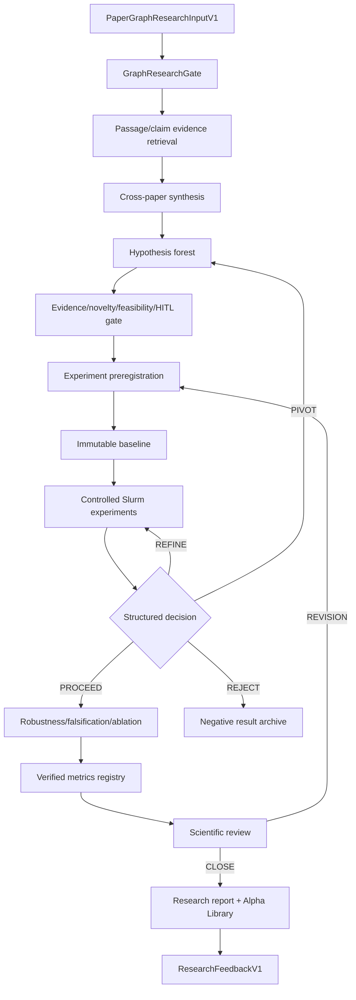

# Agent Alpha：面向每个 Paper Graph 的学术级 Auto-Research 专项计划

> 说明：本文保留 graph research control plane 和参考系统审计基线。因子研究的三项目整体流程、新颖性边界、mutation 分类、memory promotion、统计隔离和首个 pilot 以 [因子 Auto-Research 整体计划](factor-auto-research-three-project-plan.md) 为准；两者冲突时采用后者的因子专用约束。

## 1. 目标

将 Agent Alpha 从当前的：

```text
单篇 paper / reading note
  -> AlphaSignal
  -> FactorCandidate
  -> fac-eval
  -> accept / revise / reject
```

升级为：

```text
一个版本化 Paper Graph
  -> 跨论文证据综合
  -> 多个可证伪研究假设
  -> 每个假设的实验树
  -> 复现 / baseline / robustness / falsification / ablation
  -> 学术级评审与结论
  -> Alpha Library + ResearchFeedback
```

核心调度单位不再是 paper、signal 或 factor，而是：

> **一个不可变的局部 Paper Graph 快照对应一个独立 `GraphResearchRun`。**

每个通过资格门控的 graph 都应拥有自己的问题、证据包、假设 forest、实验预算、候选谱系、评价、研究报告和反馈。不同 graph 的指标、证据、memory 和 fac-eval 输出不得混在一起。

本计划不把 Agent Alpha 改造成文献爬虫或图数据库：

- Paper Graph 仍负责 canonical identity、graph 构建和关系；
- Paper Digest New2 仍负责全文和 evidence；
- Agent Alpha 负责 graph-conditioned scientific research。

## 2. 参考实现审计基线

参考仓库被浅克隆到独立只读审计目录 `/home/gaozh/auto-research-references`，不作为生产依赖，也不复制到三个主仓库的数据目录。

| 项目 | 固定审计提交 | 可借鉴 | 不直接复用 |
|---|---|---|---|
| `karpathy/autoresearch` | `228791f` | 窄修改面、immutable harness、固定预算、baseline/candidate/keep-reject、失败日志 | Git reset、单指标贪心、提示词式安全边界、登录节点无限循环 |
| `SakanaAI/AI-Scientist-v2` | `96bd516` | search forest、draft/debug/improve、节点 journal、多 seed、阶段 champion、树可视化 | 受限许可证源码、`exec()` 执行、危险全局进程清理、无真正 resume、代码节点冒充科学假设 |
| `aiming-lab/AutoResearchClaw` | `e2e23c9` | StageContract、HITL session、PIVOT/REFINE、原子 checkpoint、VerifiedRegistry、sandbox policy | 23-stage 大而全耦合、重复 crawler、未接线的 branching/checksum/budget、强制 PROCEED、subprocess 降级 |
| `allenai/ai2-scholarqa-lib` | `a962328` | passage-first retrieval、quote extraction、跨论文 planning/synthesis、结构化 citation、stage trace | Semantic Scholar identity 替代 canonical ID、author-only citation、模糊 quote match 充当 entailment |
| `lamm-mit/SciAgentsDiscovery` | `c5c3045` | graph-path-conditioned ideation、Ontologist/Scientist/Critic 分工、proposal expansion | 材料学 ontology、预生成 embedding、AutoGen notebook 编排、Semantic Scholar novelty 自评、生产 graph/identity 替代 |

许可策略：只借鉴通用架构思想并独立实现。特别是 AI-Scientist-v2 使用自定义受限源码许可证，禁止直接复制其源码、prompt、模板和可视化实现到 Agent Alpha，除非另行完成许可审核。

### 2.1 第二轮候选筛选：明确不全量采用

2026-08-10 对 The AI Scientist v1、CycleResearcher、SciAgents、CMU Coscientist、Google AI Co-Scientist、SciPIP、MOOSE 和 EvoSci 进行了真实性、许可与实现完整度核验。采用分为三种含义：

- **选入设计基线**：进入本计划的明确设计来源，但仍按本项目契约独立实现；
- **只保留论文级模式**：不克隆、不引入代码，仅保留一个具体思想；
- **排除**：不作为当前实现或依赖候选。

| 候选 | 事实核验 | 决定 | 原因 |
|---|---|---|---|
| The AI Scientist v1 | 官方仓库 `SakanaAI/AI-Scientist`，真实实验/写作/review pipeline；当前为定制受限许可 | **排除代码；不新增参考仓库** | v2 已覆盖并改进其主要实验搜索思想；v1 的模板、Aider 执行、文献搜索和论文生成与当前设计重叠，增加任意代码执行与许可负担 |
| CycleResearcher | 官方代码实际在 `zhu-minjun/Researcher`；公开核心更接近论文文本生成与模拟审稿，不是完整真实实验 runner | **排除代码和模型** | gated 模型、高 H100 需求、定制许可与许可标注冲突；公开流程缺乏可核验的真实 experiment-result 回填 |
| MIT SciAgents | 官方仓库 `lamm-mit/SciAgentsDiscovery`，Apache-2.0；graph path + multi-agent idea 原型 | **选入设计基线；仅克隆此新增项目** | 与“每个 graph 做研究”最互补；采用 graph-conditioned proposal 与 evidence/quant critic 分工，不采用材料图、embedding 和 AutoGen runtime |
| CMU Coscientist | `gomesgroup/coscientist` 是化学机器人论文 supporting repository；Apache-2.0 + Commons Clause | **排除** | 完整实验室系统并未开源，公开 simple implementation 过小且含不安全 `eval()`；化学硬件与量化研究不匹配 |
| Google AI Co-Scientist | 论文/官方介绍公开，未发现官方完整代码 | **只保留 supervisor/worker 思想** | 异步 hypothesis evolution 有参考价值，但无可审计生产代码；LLM Elo 不得替代真实回测与统计门控 |
| SciPIP | `cheerss/SciPIP`，MIT；实现语义/关键词/共引检索与聚类，但依赖外部 Neo4j/embedding | **只保留检索模式，不克隆** | 与 Paper Graph 检索和 Digest 解析职责高度重叠；不能引入第二套 identity、crawler、database 或 embedding pipeline |
| MOOSE | `ZonglinY/MOOSE`，代码公开但仓库无代码许可证 | **只读论文思想，不克隆** | Background→Inspiration→Hypothesis 与 past/present/future feedback 值得映射；源码无明确授权且工程路径高度定制 |
| EvoSci | ACL 2026 Long Paper；截至核验日未发现可确认的官方代码 | **暂缓实现完整框架** | 只保留 problem clusters、mutation/crossover/selection 和 meta-review 语义；无代码、依赖、异常、成本和许可事实可审计 |
| AutoGen / CrewAI | 通用 agent 编排框架，不是本项目科学事实与实验契约 | **不作为架构底座** | 角色聊天不等于 evidence provenance、state machine、Slurm、resume 或 scientific validity；先实现小型显式 reducer/orchestrator |

本轮唯一新增浅克隆是 `/home/gaozh/auto-research-references/SciAgentsDiscovery`，固定提交 `c5c30451b29cba813a11b5ce078909a214dad9f2`。未安装依赖、未下载其 graph/embedding、未调用 API、未运行 notebook。

### 2.2 SciAgents 的最小吸收面

只吸收两个接口语义：

1. `GraphPathContextV1`：从不可变 Paper Graph 中选择有方向、带 provenance 的 paper/claim path，作为 hypothesis 的受控上下文；
2. `HypothesisReviewPanelV1`：用角色分工而不是自由群聊完成确定性阶段：
  - graph/evidence interpreter；
  - hypothesis proposer；
  - evidence critic；
  - quant-method critic；
  - experiment planner；
  - meta-review reducer。

明确不吸收：

- `bio-graph-1K` 材料 ontology；
- BGE node embeddings 或任何新 embedding 生成；
- `pyautogen` group chat 作为核心状态机；
-运行时 Semantic Scholar 搜索作为 novelty ground truth；
-“每个图概念都必须出现在 proposal”这类会迫使模型编造连接的 prompt；
-仅由 LLM 给出的 novelty/feasibility 分数；
-材料学专用 mechanism、molecular modeling 和 synthetic biology 角色。

量化版本中的 graph path 只提供候选机制和检索先验。每个跨论文推断仍必须由 Digest evidence 支持，每个 alpha 结论仍必须由预注册 fac-eval、稳健性和 falsification 决定。

## 3. 当前 Agent Alpha 与目标的差距

### 3.1 当前实际主键链

```text
paper_id
  -> reading_note_id
  -> signal_id
  -> factor_id / candidate_id
  -> evaluation
```

缺少：

```text
research_run_id
  -> graph_id + graph_version
  -> hypothesis_id
  -> experiment_id
  -> run_attempt_id
```

### 3.2 现有 schema 的限制

- `ReadingNoteV1` 只代表单篇论文；
- `AlphaSignal` 只有单数 `source_paper_id`；
- `FactorCandidate` 不直接保存 paper、claim 和 evidence；
- batch workflow 只是扁平 signals 列表，不按 graph 分组；
- metrics 主要按 `factor_id` join；
- fac-eval run ID 可能在不同 graph 的同一 generation 间冲突；
- memory 没有明确区分 graph-local 与 global-transfer；
- evaluator 主要评价 factor quality，没有完整 graph evidence faithfulness；
- `run_manifest.py` 已定义目录雏形，但当前没有接入主要 workflow。

### 3.3 应保留的现有能力

不重写以下成熟链条：

- reading gate；
- LLM JSON schema 和字段白名单；
- `AlphaSignal` / `FactorCandidate` 生成；
- ASL prefix expression；
- validator、deterministic renderer、`py_compile`；
- fac-eval adapter；
- implementation/statistical/risk/economic evaluator；
- candidate pool、mutation、crossover、lineage；
- feedback/function/transfer/specialist memory；
- alpha library。

改造重点是在它们上方增加 graph research control plane，并让 graph/run/evidence context 贯穿下游。

## 4. 基本研究对象

### 4.1 `PaperGraphResearchInputV1`

Paper Graph 为 Agent Alpha 输出一个不可变 graph artifact：

```text
schema_version
graph_id
graph_version
graph_artifact_id
created_at / as_of_date
seed_paper_ids[]
paper_nodes[]
relation_edges[]
research_question
graph_selection_reason
snapshot_id
producer_revision
config_hash
content_hash
```

约束：

- 所有 paper 使用 `canonical_paper_id`；
- `CITES`、`CITATION_SIMILAR_TO` 和 claim-level relations 分开；
- 每条事实边带 provenance；
- graph 固定后研究过程中不可原地修改；
-扩图产生新的 `graph_version` 或新的 graph artifact；
- 不得用 title matching 恢复身份。

### 4.2 graph 研究资格

不是任何空图或低证据图都直接调用 LLM。每个 graph 先经过 `GraphResearchGate`：

- canonical identity 完整；
- seed 和 graph snapshot 可重现；
- 至少有显式引用结构；
- 至少一个节点具有 Digest evidence，或明确标记 structural-only；
- graph 不存在未解决的身份冲突；
- 有明确研究问题或选择理由；
- graph 没有在相同版本和配置下完成过研究。

结果：

- `eligible`：进入完整研究；
- `structural_only`：只做结构假设和 evidence-gap 输出，不生成事实性 claim；
- `needs_digest`：返回全文队列；
- `rejected`：保存原因，不启动研究。

### 4.3 `GraphEvidenceBundleV1`

由 graph 与 Digest artifacts 组合得到：

```text
bundle_id
graph_id / graph_version
paper_artifact_refs[]
claims[]
evidence_spans[]
claim_relation_refs[]
retrieval_trace[]
coverage_by_paper
coverage_by_relation
missing_evidence[]
```

每个 evidence span 至少包含：

```text
evidence_id
canonical_paper_id
document_version
chunk_id
quote
section
page / TeX anchor / source offsets
content_hash
retrieval_reason
alignment_method
alignment_confidence
```

稳定 ID 优先；模糊文本回映射只能作为显式低置信度 fallback，不能自动建立 claim relation。

## 5. 科学节点模型

必须区分科学分支与代码重试。

### 5.1 `HypothesisNodeV1`

一个 graph 生成多个假设根节点：

```text
hypothesis_id
research_run_id
graph_id
statement
mechanism
prediction
market / asset / frequency / horizon
source_paper_ids[]
source_claim_ids[]
evidence_ids[]
relation_evidence_ids[]
novelty_rationale
falsification_criteria
expected_failure_modes
status
```

状态：

```text
proposed -> evidence_checked -> approved -> testing
         -> supported | refuted | inconclusive | abandoned
```

假设必须可证伪，并说明相对 prior work 的增量。单篇论文推断与跨论文综合必须显式区分。

### 5.2 `ExperimentNodeV1`

每个 hypothesis 下建立实验分支：

```text
experiment_id
hypothesis_id
parent_experiment_ids[]
operation_type
factor_instance_ids[]
pre_registered_primary_metric
acceptance_rule
universe / market_data_version
train/validation/test windows
embargo / purge / cost assumptions
robustness dimensions
budget
status
```

`operation_type`：

- `replication`
- `baseline`
- `primary_test`
- `robustness`
- `falsification`
- `ablation`
- `parameter_refine`
- `mechanism_pivot`
- `factor_mutation`
- `factor_crossover`

### 5.3 `RunAttemptV1`

代码错误和基础设施重试不创建新的科学 experiment：

```text
run_attempt_id
experiment_id
attempt_number
code_hash
environment_hash
Slurm job_id
resources / timeout
stdout / stderr / exit_code
artifacts
failure_type
started_at / completed_at
```

这样 `debug_depth` 与科学 branch depth 分离。

### 5.4 因子三重身份

必须分开：

1. `factor_definition_id`：规范 ASL 表达式的全局身份；
2. `factor_instance_id`：定义 + graph run + 数据/config 版本；
3. `candidate_id`：搜索池中的具体候选记录。

同一表达式在不同 graph 中可共享 definition，但 evaluation、evidence、lineage 和 admission 不能被去重或串联。

## 6. 学术级 Auto-Research 流程



### Stage A：Graph Intake

1. 校验 schema、canonical IDs、graph hash 和 relation provenance；
2. 建立 `research_run_id`；
3. 检查重复 run 和 resume 状态；
4. 运行 `GraphResearchGate`；
5. 写入 immutable run manifest。

### Stage B：Evidence Retrieval and Synthesis

借鉴 ScholarQA 的 passage-first 方法：

1. graph 关系作为 retrieval prior；
2. 每篇论文按研究问题检索 claims/passages；
3. 保留完整召回集与 rerank trace；
4. 每篇先提取 quotes，再跨论文规划；
5. 区分 agreement、conflict、qualification、replication 和 evidence gap；
6. 只将实际使用的 evidence refs 传给假设。

不得一次把整个 graph 的全文塞入单个 prompt。

### Stage C：Hypothesis Forest

Idea Person 不再对一篇 reading note 单独生成 signal，而是：

1. 对 graph 生成多个 `HypothesisNodeV1`；
2. 每个假设绑定 claims/evidence/relations；
3. 检查 novelty、可行性、数据字段和可证伪性；
4. 对低证据假设输出 `needs_evidence`；
5. 通过 HITL 或可审计 auto-gate 后进入实验。

建议首个 pilot 每图最多：

- 3 个假设；
- 每假设 1 个 baseline + 2 个 primary candidates；
- 后续最多 2 轮 refine/pivot。

### Stage D：Experiment Preregistration

在看到 test 指标前固定：

- primary metric 和方向；
- acceptance threshold；
- train/validation/test 时间段；
- purge/embargo；
- universe、频率和标签；
- 交易成本、换手和容量假设；
-随机 seed；
- robustness/falsification checklist；
-预算和停止条件。

修改预注册内容必须生成新 experiment version，不得覆盖。

### Stage E：Immutable Harness and Execution

借鉴 autoresearch，但使用硬边界：

不可变：

- graph/evidence artifacts；
-市场数据 snapshot；
- split、cost、metric 和 evaluator；
- field/operator whitelist；
- resource budget；
- baseline definition。

可变：

- `AlphaSignalV2`；
- ASL `FactorCandidateV2`；
-白名单内参数；
- mutation/crossover proposal。

所有实验：

- 由 Slurm 提交；
- 独立工作目录；
- 输入只读；
- 默认网络关闭；
- 固定 CPU/GPU/memory/time；
- 禁止动态安装依赖；
- 不允许 sandbox 不可用时降级为登录节点 subprocess；
- 超时由 Slurm wall time 处理，agent 不主动 kill。

### Stage F：Structured Decision Loop

统一决策 schema：

```text
PROCEED
REFINE
PIVOT
REJECT
PAUSE_EVIDENCE
PAUSE_BUDGET
INCONCLUSIVE
```

- `REFINE`：保持 hypothesis，只调整实现/参数；
- `PIVOT`：改变机制、证据组合或 graph 邻域；
- `REJECT`：分支关闭并保存负结果；
-预算耗尽不能强制 `PROCEED`；
-所有 decision 保存 reason、input metrics、evidence 和 parent IDs。

### Stage G：Robustness and Falsification

primary test 通过后才运行：

-多随机 seed；
-多个时间窗口/市场状态；
-成本和滑点敏感性；
-universe/asset 子集；
-替代标签/horizon；
-关键组件消融；
-placebo、反向或延迟测试；
-数据泄漏和多重检验检查；
-与 Alpha Library 的重复/增量价值比较。

### Stage H：Verified Facts and Scientific Review

建立 `VerifiedMetricRegistryV1`，报告和 review 只能引用其中的数值：

```text
metric
factor_instance_id
experiment_id
market_data_version
universe
period
condition
seed
value / mean / uncertainty
source_artifact
content_hash
```

评审至少分开：

1. implementation validity；
2. statistical validity；
3. risk/cost/capacity；
4. economic mechanism；
5. evidence grounding；
6. novelty/duplication；
7. robustness/falsification；
8. reproducibility。

Reviewer 的结论可以触发 revision/falsification，不应只是终端文本评分。

### Stage I：Research Output and Feedback

每个 graph run 输出：

```text
manifest.json
stage_events.jsonl
graph_evidence_bundle.json
hypotheses.jsonl
experiments.jsonl
run_attempts.jsonl
factor_candidates.jsonl
lineage.jsonl
evaluations.jsonl
verified_metrics.jsonl
selection_trace.jsonl
negative_results.jsonl
research_report.md
research_feedback.json
```

`ResearchFeedbackV1` 返回：

- accepted/rejected/inconclusive hypotheses；
- accepted/rejected factor instances；
- paper/claim/evidence contribution；
- contradiction 和 replication 结果；
- evidence gaps；
-需要 Digest 补全文的 paper IDs；
-建议 Paper Graph 扩展的节点/关系；
-机制和 mutation performance；
-下一 graph 优先级信号。

## 7. 状态机与恢复

### 7.1 Run 状态

```text
CREATED
VALIDATED
EVIDENCE_READY
HYPOTHESES_READY
APPROVAL_PENDING
EXPERIMENTS_QUEUED
RUNNING
REVIEW_PENDING
COMPLETED
PAUSED_EVIDENCE
PAUSED_BUDGET
FAILED_RETRYABLE
FAILED_FINAL
```

### 7.2 Candidate 状态

```text
PROPOSED -> VALIDATED -> RENDERED -> COMPILED
         -> SCHEDULED -> RUNNING -> EVALUATED
         -> ACCEPTED | REVISE | REJECTED | FAILED | TIMED_OUT | SUPERSEDED
```

必须验证合法 transition，禁止任意字符串更新。

### 7.3 Artifact manifest

每个 stage manifest 至少保存：

- producer Git revision 和 dirty-tree 状态；
- graph、Digest、market data 和 config hashes；
-输入/输出 artifact SHA256；
- parent manifest；
- Slurm job ID；
-资源和预算消耗；
-状态、决策和理由；
-开始/完成时间。

采用临时文件 + atomic rename。Resume 前验证 manifest 和 hash；不加载不可信 Pickle，不只依赖“最后阶段编号”。

## 8. Memory 分层

### Run-local memory

只影响当前 graph/run：

- evidence retrieval trace；
- hypothesis decisions；
- branch failures；
- factor candidates；
- local feedback；
- budget events。

### Global transfer memory

只有通过明确 promotion gate 的经验才能进入：

- field/operator behavior；
-普遍 mutation 成败；
-跨 graph 重复验证的机制；
-通用 implementation repair；
-稳定风险规则。

不得把某个 graph、某个时间窗的失败直接写成全局 BAD 规则。

## 9. Agent Alpha 代码改造计划

建议新增：

```text
src/agent_alpha/contracts/
    research_artifact.py
    graph_research.py
    research_feedback.py
    experiment_result.py
src/agent_alpha/graph_research/
    graph_gate.py
    evidence_index.py
    evidence_retriever.py
    evidence_synthesizer.py
    hypothesis_generator.py
    hypothesis_gate.py
    preregistration.py
    state_machine.py
    orchestrator.py
    checkpoint.py
    verified_metrics.py
src/agent_alpha/evaluation/
    evidence_grounding_checker.py
    graph_research_evaluator.py
src/agent_alpha/workflows/
    run_paper_graph_research.py
src/agent_alpha/feedback/
    upstream_feedback.py
```

建议扩展而不立即破坏：

- `AlphaSignalV2`：增加 `research_run_id`、`graph_id`、多 paper/claim/evidence refs 和 `synthesis_type`；
- `FactorCandidateV2`：增加 definition/instance/run/graph/evidence/parents；
- CandidatePool：保留全部 `parent_ids`，增加合法状态机；
- fac-eval run ID：`<research_run_id>_<experiment_id>_<attempt>`；
- evaluator：必须接收 source signal、hypothesis、evidence 和 preregistration；
- alpha library：保存完整 candidate、evidence、lineage、data/config versions；
- memory：增加 run-local/global scope；
- `run_manifest.py`：接入 orchestrator 并升级 manifest。

旧 V1 schema 和单-paper workflow 先保留为兼容入口，通过 adapter 升级到 V2；不要一次性破坏历史 JSONL、fixtures 和 prompts。

## 10. 分阶段实施

### GA0：事实基线与契约

交付：

- 冻结现有 Agent Alpha 测试与实际行为清单；
- 修复 README/测试/实现不一致；
- 定义 `PaperGraphResearchInputV1`、`GraphEvidenceBundleV1`、`ResearchFeedbackV1`；
- 定义 graph/run/hypothesis/experiment/attempt IDs；
-写 schema 与 migration tests。

Gate：一个合成 graph 能离线校验；title-only identity 被拒绝。

### GA1：Graph Intake 与 context propagation

交付：

- graph importer；
- `GraphResearchGate`；
- `research_run_id`；
-从 signal 到 alpha-library 的 context propagation；
- definition/instance/candidate identity 分离；
- fac-eval output isolation。

Gate：两个 graph 使用相同表达式时 definition 相同、instance/evaluation 不串联。

### GA2：Evidence retrieval 与 synthesis

交付：

- Digest adapter；
- passage/claim retrieval；
- quote/evidence trace；
- agreement/conflict/qualification/evidence-gap synthesis；
- graph-level evidence gate。

Gate：所有 hypothesis 可回溯到 graph 内稳定 evidence；无双方证据不能声称 contradiction。

### GA3：Hypothesis forest 与 preregistration

交付：

- `HypothesisNodeV1`；
- hypothesis gate；
- experiment templates；
- preregistration artifact；
- HITL approve/revise/reject；
- structured decision schema。

Gate：一个 graph 生成最多3个可证伪假设，每个假设有预注册实验和明确停止条件。

### GA4：受控实验与 resume

交付：

- Slurm experiment adapter；
- immutable harness；
- `RunAttemptV1`；
- atomic checkpoint；
- SHA256 manifest verification；
- budget ledger；
- `PAUSED_BUDGET` / `FAILED_RETRYABLE` resume。

Gate：中断后可从最后完整 artifact 恢复，不重复已验证实验，不依赖 kill。

### GA5：Tree search、REFINE/PIVOT 与负结果

交付：

-每 graph search forest；
-科学 branch 与 debug attempt 分离；
-受预算的 frontier；
- REFINE/PIVOT/REJECT；
- lineage DAG；
- negative result archive；
- selection trace 和确定性 fallback。

Gate：失败/否证/预算耗尽均成为可审计终态，不强制接受。

### GA6：Robustness、Verified Metrics 与学术评审

交付：

-多 seed/时期/universe/cost/ablation/falsification；
- `VerifiedMetricRegistryV1`；
- evidence-grounded reviewer；
- revision feedback loop；
- graph research report。

Gate：报告中每个实验数字均能定位到 immutable result artifact。

### GA7：三项目闭环 pilot

交付：

- Paper Graph graph artifact；
- Digest evidence envelope；
- Agent Alpha graph run；
- `ResearchFeedbackV1`；
- Graph/Digest feedback ingestion；
-一图端到端 trace。

Gate：一张 graph 能从 canonical IDs 追踪到 evidence、hypothesis、factor、experiment、review、alpha admission 和 upstream feedback。

### GA8：30-graph FinSciNet/Auto-Research 评测

在 OpenAlex、identity、30-seed graph 和 Digest gates 通过后：

-每 graph 独立 run；
-比较单-paper baseline 与 graph-conditioned system；
-评估 hypothesis grounding、relation use、retrieval coverage、实验成功率、负结果率、重复因子率、增量 Alpha、成本和人工审核一致性；
-固定 benchmark corpus/config/time cutoff。

所有实际 LLM、全文和实验运行通过 Slurm；先运行 1 graph，再 3 graph，最后才是 30 graph。

## 11. 第一批具体实现任务

按顺序：

1. 为 Agent Alpha 当前 graph 缺口建立回归测试；
2. 新建 `contracts/graph_research.py` 和 schema fixtures；
3. 接通现有 `run_manifest.py`；
4. 实现 `GraphResearchContext` 及全链 propagation；
5. 分离 factor definition/instance/candidate identity；
6. 实现 graph-scoped fac-eval run IDs 和输出目录；
7. 实现 `GraphResearchGate`；
8. 对一个合成 graph 运行 fake-LLM/no-network 测试；
9. 实现 Digest evidence adapter 和 graph evidence bundle；
10. 再实现 hypothesis forest 和学术实验状态机。

不要先复制完整 AI Scientist 或 AutoResearchClaw pipeline；先把 graph/run identity、evidence provenance、实验隔离和 resume 做对。

## 12. 验收指标

### 契约与溯源

- 100% run 有 graph/version/hash；
- 100% signal/factor/evaluation 可回链到 run；
- 100%事实性 hypothesis 有稳定 evidence IDs；
- 0 次 title-only 自动身份连接；
- 0 次跨 graph metric/output 串联。

### 研究质量

- hypothesis 可证伪率；
-跨论文综合占比；
-支持/冲突/限定关系使用正确率；
- preregistration 遵守率；
- holdout、成本、robustness 和 falsification 完成率；
- accepted/rejected/inconclusive 分布；
-相对单-paper baseline 的增量 Alpha 和重复率。

### 工程质量

- stage artifact hash 覆盖率；
- resume 成功率；
- Slurm job 与 run manifest 对齐率；
-预算超限为零；
-生成代码越权、联网和修改 immutable inputs 为零；
-失败、负结果和 exclusion reason 保存率为100%。

## 13. 最终设计判断

Agent Alpha 不应升级成“一键从主题写论文”的大而全 agent。更可靠的目标是：

> **以 Paper Graph 为研究问题和关系上下文，以 Paper Digest 为证据基础，以 Agent Alpha 为可证伪假设和受控实验引擎。**

应组合吸收：

- autoresearch 的窄修改面、固定 harness 和预算；
- AI-Scientist-v2 的 search forest、journal、多 seed 和 tree inspection；
- AutoResearchClaw 的 stage contract、HITL、PIVOT/REFINE、VerifiedRegistry 和 checkpoint policy；
- ScholarQA 的 passage-first evidence synthesis 和 citation trace；
- Agent Alpha 已有的 ASL、fac-eval、evaluation、lineage 和 memory。

所有控制面围绕本项目自己的 canonical graph/evidence/experiment contracts 独立实现，不让第三方框架成为生产依赖。
