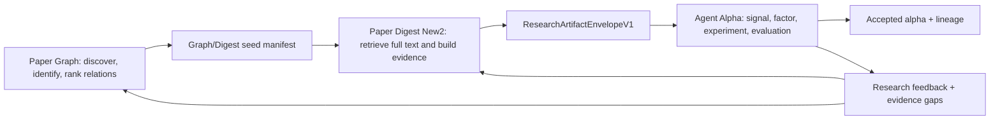

# AI handoff: Paper Graph + Paper Digest New2 + Agent Alpha

Last verified: 2026-08-10.

This is the first document a new AI agent should read in the `quant-research-loop.code-workspace` multi-root workspace. It records the current state, operating constraints, OpenAlex acquisition status, cross-project contracts, and the intended closed loop.

## 1. Workspace roots

The workspace file is `paper graph/quant-research-loop.code-workspace` and contains:

| Workspace name | Absolute path | Role |
|---|---|---|
| `paper-graph` | `/home/gaozh/paper graph` | canonical paper identity, OpenAlex corpus, citation/relationship graph, retrieval and prioritization |
| `my-paper-digest-new2` | `/home/gaozh/my-paper-digest-new2` | source acquisition, arXiv TeX/PDF/HTML parsing, evidence packs, evidence-backed reading artifacts |
| `agent-alpha` | `/home/gaozh/agent_alpha` | AlphaSignal/FactorCandidate generation, controlled execution, fac-eval, review, mutation, lineage and alpha library |

Do not merge these repositories or copy their large data directories into one another. Integrate through versioned artifacts and adapters.

All three repositories may contain uncommitted work. Never reset, clean, checkout over, or discard existing changes unless the user explicitly requests it.

## 2. Final closed loop



The target is not three independent pipelines. The target is one auditable research loop:

1. Paper Graph finds and ranks canonical quantitative-finance papers and their citation neighborhood.
2. Paper Graph produces separate graph and Digest seed manifests.
3. Paper Digest New2 retrieves exact full text and emits evidence-backed reading artifacts.
4. Agent Alpha consumes those artifacts, generates signals and factors, runs controlled experiments, and evaluates results.
5. Agent Alpha returns success/failure, evidence gaps, mechanism performance, and factor lineage upstream.
6. Paper Graph uses feedback to prioritize related papers, unresolved claims, replications, contradictions, and novel combinations.

## 3. Non-negotiable operating constraints

1. Long-running downloads, scans, graph builds, full-text collection, LLM runs, experiments, and model runs must be submitted through Slurm. Do not run them directly on the login node.
2. Use a cheap probe, syntax/config check, and startup-log check before any large Slurm run.
3. Do not kill or interrupt a background process or Slurm job unless the user explicitly says `kill`.
4. Do not submit new embedding-generation jobs. Reuse existing embeddings; otherwise use citation-only structural graphs.
5. Do not change API keys, proxy configuration, or rate-limit policy without explicit approval.
6. Do not expose credentials in code, logs, prompts, manifests, or chat.
7. Preserve raw retrieval records and provenance. Screening adds status; it does not delete or overwrite source recall.
8. Use exact identity evidence for automatic merges. Title similarity is review-only.
9. Generated/LLM-written experiment code must run in a controlled environment with immutable inputs, budgets, and artifact manifests.
10. Keep all stage outputs resumable, versioned, and linked by stable IDs.

## 4. OpenAlex pinned snapshot

### Fixed baseline

- Entity/format: OpenAlex `works` Parquet.
- Pinned manifest date: `2026-06-26`.
- Manifest totals: 510,372,821 Works; 2,446 Parquet shards; 724,970,323,127 bytes (about 725 GB).
- Local root: `/home/gaozh/paper graph/data/raw/openalex/2026-06-26/parquet/works`.
- Pinned manifest: `data/raw/openalex/2026-06-26/parquet/works/manifest.json`.
- Download script: `scripts/sync_openalex_snapshot.py`.
- The synchronizer is resumable: exact-size complete files are reused; `.partial` files continue through HTTP Range; a changed manifest is refused in the pinned directory.

### Last verified local download state

As of 2026-08-10 after the first Gate 2 implementation pass:

- manifest present: yes;
- complete local Parquet shards: 7;
- `.partial` shards: 0;
- downloaded bytes: 1,068,006,868;
- `sync-summary.json`: `selected_file_count=7`, `complete_entity=false`;
- Slurm job `3963111` (`oa-85-sample`) completed successfully with exit code `0:0` at `2026-08-10T15:17:39`;
- its final extraction summary contains 514,908 post-2016 Works scanned, 9,948 retrieval candidates, 1,140 old-rule accepted, 8,076 old-rule review, 732 old-rule rejected, 1,292 exact arXiv identities, 631 graph-seed-eligible rows and 79 Digest-seed-eligible rows;
- the completed job must not be resubmitted. Its evidence remains `logs/openalex-85-sample-3963111.out` and `data/processed/openalex_quant_sample/summary.json`.

This is a seven-shard representative sample, not the full snapshot.

### Slurm entry points

- connectivity/format probe: `slurm/openalex_snapshot_probe.sbatch`;
- seven-shard representative sample and extraction: `slurm/openalex_stratified_sample.sbatch`;
- full snapshot: `slurm/openalex_snapshot_full.sbatch`;
- extraction probe: `slurm/openalex_extract_probe.sbatch`.

The full snapshot job must not be submitted until Gate 2 sample review passes.

### Execution gates

1. Gate 1 — schema/connectivity probe: passed.
2. Gate 2 — seven-shard extraction completed; deterministic false-positive review is in progress and Gate 3 is not yet approved.
3. Gate 3 — full manifest-pinned snapshot download and shard extraction.
4. Gate 4 — canonical identity/duplicate audit.
5. Gate 5 — 30-seed structural citation pilot.
6. Gate 6 — small exact-arXiv Digest pilot.
7. Gate 7 — balanced production scale.

Never skip a gate.

## 5. Paper Graph state and contracts

Authoritative plans:

- `docs/global-implementation-plan.md`;
- `docs/openalex-85-keyword-seed-plan.md`;
- `docs/scinet-adaptation-plan.md`.

Current phase: Phase 1, Gate 2 finance-domain audit after successful representative-shard extraction.

The first Gate 2 implementation pass added versioned `finance_audit_v2`, deterministic keyword/field/year summaries, a fixed-seed 180-row human-review sample, and partitioned-Parquet/checkpoint helpers. Re-auditing the unchanged 9,948-row retrieval baseline produced 332 accepted, 8,547 review and 1,069 rejected rows. These are provisional automatic labels, not a Gate 2 pass: `data/processed/openalex_quant_gate2_v1/review_sample.jsonl` still requires independent human labels and accepted precision must be at least 90%.

Review of the sample found that OpenAlex-generated keywords/topics and broad anchors caused severe false positives. `finance_audit_v3` therefore gives metadata-only matches zero acceptance score, requires authored title/abstract evidence, never auto-accepts from abstract evidence alone, and restricts direct title acceptance to high-precision trading/microstructure phrases. The strict re-audit under `data/processed/openalex_quant_gate2_v3_strict` preserves all 9,948 retrieval rows and yields 20 accepted, 6,636 review and 3,292 rejected. All 20 accepted rows are included in its fixed-seed 180-row sample for manual precision review; Gate 2 remains pending.

A one-shard cheap probe of the new Parquet path passed and then resumed from verified source/config/output hashes under `data/processed/openalex_quant_parquet_probe_v1`. The full seven-shard Parquet conversion has not been run.

### Corpus separation

Keep these products distinct:

1. retrieval superset: every Work with any exact keyword hit;
2. finance-reviewed corpus: `accepted | review | rejected`, with reasons;
3. graph and Digest seed manifests: separate eligibility rules.

The source vocabulary is the exact 85 terms in `/home/gaozh/my-paper-digest-new2/config/sources.yaml`. Underscore/hyphen/space aliases normalize to 79 canonical phrases. Retrieval is any title, OpenAlex keyword, topic, or reconstructed-abstract hit. Weights rank results but must not remove rows.

Generic terms such as `machine learning`, `intraday`, and `out-of-sample` need a finance anchor before automatic acceptance. Corporate-finance uses of liquidity and other non-market contexts are known false-positive risks.

### Identity rules

Automatic identity order:

1. exact canonical arXiv ID;
2. exact normalized DOI;
3. title/author/year similarity only creates a review candidate.

arXiv ID recovery order:

1. `ids.arxiv`;
2. location OAI ID such as `pmh:oai:arXiv.org:<id>`;
3. arXiv landing/PDF URLs in locations;
4. DOI `10.48550/arXiv.<id>`.

`indexed_in=arxiv` is only a hint and cannot establish an arXiv identity.

### Relationship semantics

- `CITES`: explicit directed reference evidence only.
- `CITATION_SIMILAR_TO`: computed bibliographic coupling/co-citation; keep components.
- `EMBEDDING_SIMILAR_TO`: only from reused embeddings.
- `SUPPORTS`, `CONTRADICTS`, `REPLICATES`, `EXTENDS`, `QUALIFIES`: claim-level only, with evidence on both sides.

### Core modules

- `src/paper_graph/openalex_snapshot.py`: abstract recovery, keyword classification, arXiv extraction.
- `src/paper_graph/identity.py`: exact identity grouping and representative selection.
- `src/paper_graph/snapshot_query.py`: local DuckDB Work/title/inbound/outbound queries.
- `scripts/sync_openalex_snapshot.py`: manifest-pinned resumable synchronization.
- `scripts/extract_openalex_quant_candidates.py`: retrieval/audit/identity/seed projection.
- `src/paper_graph/digest_adapter.py`: current Digest adapter; must evolve to the shared cross-project artifact.

Immediate Paper Graph work:

1. independently label the fixed 180-row strict-v3 Gate 2 review sample, starting with all 20 automatically accepted rows;
2. compute accepted precision and inspect status transitions, especially `machine learning`, `intraday`, `market liquidity`, corporate liquidity and non-finance uses of microstructure;
3. adjust `finance_audit_v3` only if the labeled sample requires it, while preserving all 9,948 retrieval rows and match evidence;
4. after focused tests and the one-shard probe, run the seven-shard Parquet conversion through Slurm rather than on the login node;
5. approve Gate 3 only if accepted precision is at least 90% and the partitioned products reconcile with retrieval;
6. after Gate 3, run exact identity grouping and select 30 citation-graph seeds plus an exact-arXiv Digest subset.

## 6. Paper Digest New2 role

Repository: `/home/gaozh/my-paper-digest-new2`.

It owns source acquisition and evidence extraction:

- arXiv ID/source retrieval;
- TeX/PDF/HTML parsing;
- section-aware document chunks;
- `evidence_pack_v2`;
- three-AI reading, factor-oriented interpretation, and faithfulness audit;
- stable evidence IDs and source locations.

Important existing assets include:

- `config/sources.yaml`: canonical 85-source-term vocabulary;
- `src/arxiv/evidence_v2.py`;
- `src/llm/three_ai/pipeline.py`;
- `src/pipeline/arxiv_evidence_crawler.py`;
- `data/arxiv_evidence_archive.jsonl` and runtime state files.

Do not make Agent Alpha run a second production crawler. Digest should be the source/full-text/evidence owner.

No full-text crawler, hourly LLM pipeline, or production parsing run should be launched directly on the login node. Existing services/background processes must not be restarted or killed without explicit user instruction.

## 7. Agent Alpha role

Repository: `/home/gaozh/agent_alpha`; Git origin `2400010793/agent-alpha`.

It owns the downstream research loop:

- reading gate;
- `AlphaSignal` generation;
- `FactorCandidate` generation;
- ASL prefix expressions and field/window validation;
- controlled rendering and compilation;
- fac-eval execution and metric ingestion;
- accept/revise/reject evaluation;
- candidate pool, lineage, mutation/crossover and multi-generation search;
- evaluation memory, feedback memory and alpha-library admission;
- run manifests and reproducible artifacts.

Agent Alpha currently expects `reading_note_v1`, document chunks, source paper IDs, reading-note IDs, and evidence IDs. It also contains local document ingestion/reading code, but production integration should consume Paper Digest artifacts through an adapter rather than duplicate crawling and parsing.

The graph-by-graph academic research target, reference-system audit, contracts, hypothesis/experiment/run-attempt model, Slurm execution policy, and phased delivery gates are defined in [Agent Alpha Graph Auto-Research plan](agent-alpha-graph-autoresearch-plan.md). The factor-specific three-project target, including bounded novelty claims, mutation taxonomy, memory promotion, statistical isolation, library admission, implementation phases, and the first pilot, is defined in [Factor Auto-Research three-project plan](factor-auto-research-three-project-plan.md). The graph research control-plane kernel now exists in the Agent Alpha working tree, but production Digest, Slurm fac-eval, factor-specific aggregation, locked-test, robustness, and upstream-feedback integration are not complete; do not describe the production loop as closed until those gates pass.

An older audit reported a possible one-element tuple in the local `fac_eval_config_path` assignment. The latest source inspection did not reproduce the trailing comma, but this path still requires a focused regression test before production fac-eval because the Agent Alpha working tree is uncommitted and evolving.

## 8. Required cross-project artifact

Define and version `ResearchArtifactEnvelopeV1`. At minimum it should preserve:

```text
schema_version
artifact_id
created_at
producer_project
producer_version/config_hash
canonical_paper_id
openalex_id
arxiv_id + version
doi
title + authors + publication date
retrieval evidence and finance status
graph seed ID / graph provenance
digest document/content version
reading_note_id
document chunks and stable evidence IDs
claims/methods/datasets/results/limitations with source locations
signal_id
factor_id + parent factor IDs + mutation operation
experiment_run_id + immutable config/data hashes
metrics + evaluator decision + review reasons
upstream feedback and evidence gaps
```

The first adapter to build is:

```text
Paper Digest evidence_pack_v2 / three-AI artifact
    -> ResearchArtifactEnvelopeV1
    -> Agent Alpha reading/signal input
```

The return adapter is:

```text
Agent Alpha evaluation/lineage/alpha-library result
    -> ResearchFeedbackV1
    -> Paper Graph prioritization and Paper Digest evidence-gap queue
```

Do not connect systems by title matching or ad hoc file copying.

## 9. Recommended next implementation sequence

1. Recheck the running `oa-85-sample` job and its log; do not duplicate or interrupt it.
2. Finish Gate 2 sample summaries and finance false-positive review.
3. Define JSON Schema/dataclasses for `ResearchArtifactEnvelopeV1` and `ResearchFeedbackV1` in Paper Graph as shared contracts.
4. Add a Digest exporter/adapter that retains canonical IDs, chunk IDs, evidence spans, and content versions.
5. Add an Agent Alpha importer that bypasses duplicate crawling and validates the envelope before signal generation.
6. Run a no-network, fake-LLM contract test with one existing parsed paper.
7. Run a small exact-arXiv real Digest pilot through Slurm after queue validation.
8. Run one controlled Agent Alpha signal/factor/fac-eval path through Slurm.
9. Feed evaluation and evidence-gap artifacts back to Paper Graph.
10. Only after this one-paper loop is reproducible, scale to the 30-seed pilot.

## 10. Validation expectations

For every change:

- inspect existing code and current dirty working tree first;
- make the smallest compatible change;
- add or update focused tests;
- verify syntax/config before long execution;
- save config hashes, data/snapshot versions, logs, summaries, failures and exclusion reasons;
- do not claim a pipeline is closed until one paper can be traced from canonical identity through evidence, signal, factor, experiment, decision and upstream feedback.
