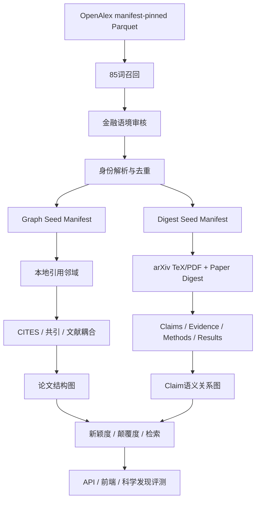

# Paper Graph 全局实施计划

## 1. 最终目标

构建一个面向量化金融研究的、可追溯的科学文献发现与知识图谱系统。系统从
OpenAlex 全局结构数据出发，以现有 85 个关键词定义召回边界，恢复 OpenAlex、
arXiv 和 DOI 身份，围绕可靠 seed 构建引用网络，再用 Paper Digest 从全文中抽取
可定位的主张、证据、方法、数据、结果和限制。最终支持关系感知检索、研究脉络、
支持/反驳关系、新颖度评价和研究假设发现。

系统不是一个简单的“论文相似度网页”，而是六个严格分层的数据产品：

1. **发现层**：哪些论文与 85 个关键词相关。
2. **身份层**：不同来源中的记录是否代表同一篇论文。
3. **结构层**：论文之间真实的引用、共引和文献耦合关系。
4. **证据层**：全文中可定位的 claim、method、dataset、result、limitation。
5. **语义关系层**：哪些 claim 支持、反驳、复现、扩展或限定另一个 claim。
6. **评价与查询层**：新颖度、颠覆度、证据质量、关系感知检索和局部图展示。

## 2. 不可违反的设计原则

1. **身份先于图谱**：没有稳定 `canonical_paper_id` 的记录不能自动合并。
2. **召回与审核分离**：命中 85 词进入召回全集；金融审核只增加
   `accepted/review/rejected`，不覆盖或删除原始召回。
3. **事实关系与计算关系分离**：`CITES`、`SUPPORTS`、`CONTRADICTS` 是有证据的
   关系；embedding 相似度只是计算关系。
4. **论文级关系与 claim 级关系分离**：论文不能仅因观点相似就标记为支持或反驳。
5. **所有输出可复现**：保存快照日期、manifest、配置哈希、规则/模型版本和证据位置。
6. **本地快照优先**：大规模结构查询使用 OpenAlex Parquet/DuckDB，不逐篇调用 API。
7. **分门控扩展**：probe 通过后才能 sample，sample 审核后才能 full run。
8. **大任务只走 Slurm**：完整下载、全量扫描、图构建、全文解析和模型运行均通过 Slurm。
9. **不新建 embedding 生成任务**：优先复用现有 embedding；没有时先构建纯引用结构图。
10. **不修改 API key、代理或限速策略**，除非用户明确批准。

## 3. 系统框架

## 4. 数据产品和契约

### 4.1 `retrieval_work_v1`：85词召回全集

每条记录至少包含：

- OpenAlex ID、标题、作者、日期、类型和语言；
- DOI和候选 arXiv 身份；
- primary topic、topics、keywords、concepts、摘要；
- 命中的原始关键词、规范关键词、命中字段和加权分数；
- references、reference count、cited-by count；
- OA、全文、撤稿、paratext、XPAC标记；
- OpenAlex快照日期和筛选版本。

进入条件：标题、keywords、topics 或摘要任一字段命中 85 词。

### 4.2 `finance_audit_v1`：量化金融审核

每条召回记录增加：

- `finance_status`: `accepted | review | rejected`；
- 正向金融锚点；
- 负向语境；
- 审核规则版本；
- 必要时人工审核决定及时间。

泛词 `machine learning`、`intraday`、`out-of-sample` 等没有金融锚点时不能自动接受。
市场微观结构、订单流、流动性、执行、波动率等强短语可以获得更高置信度。

### 4.3 `paper_identity_v1`：规范身份表

主字段：

- `canonical_paper_id`；
- `openalex_id`；
- 规范 DOI；
- `arxiv_id` 和版本；
- `identity_method`、`identity_evidence`、`identity_confidence`；
- 重复组和代表记录；
- 数据来源与快照版本。

精确合并顺序：arXiv ID → DOI。仅标题/作者/年份相似的记录进入审核队列，不能自动合并。

### 4.4 `graph_seed_manifest_v1`

进入条件：

- 金融审核 accepted；
- 身份和标题稳定；
- 非撤稿、非 paratext、非 XPAC；
- 年份满足范围；
- 有 references 或扫描后存在 inbound citation。

arXiv不是结构图 seed 的必要条件。

### 4.5 `digest_seed_manifest_v1`

进入条件：

- 图谱 seed 合格，或经过明确人工批准；
- 精确 arXiv ID，或 Digest 已支持的其他全文来源；
- 标题与身份一致；
- 尚未解析相同内容版本。

### 4.6 `paper_graph_v2`

论文节点与以下边必须独立保存：

- `CITES`：显式引用，有方向；
- `CITATION_SIMILAR_TO`：共引/文献耦合，无方向，保存分量；
- `EMBEDDING_SIMILAR_TO`：只在复用已有 embedding 时生成；
- `AUTHOR_SHARED_BY`：作者重合关系，可选展示。

### 4.7 `evidence_graph_v1`

全文解析后保存：

- `Claim`：规范命题、适用条件、研究对象；
- `Evidence`：原文、章节、页码或 TeX anchor；
- `Method`：模型、识别策略、算法；
- `Dataset`：市场、资产、样本期、频率；
- `Result`：方向、效应量、显著性和稳健性；
- `Limitation`：作者声明或审核发现。

关系包括：

- `CLAIM_SUPPORTED_BY_EVIDENCE`
- `PAPER_MAKES_CLAIM`
- `CLAIM_USES_METHOD`
- `CLAIM_USES_DATASET`
- `SUPPORTS`
- `CONTRADICTS`
- `REPLICATES`
- `EXTENDS`
- `QUALIFIES`

每条跨论文语义边必须保留双方 claim、证据位置、判断模型/规则和置信度。

## 5. 工作流和实施阶段

### Phase 0：契约与基础设施

状态：基本完成。

- 建立Python包、测试、配置和本地存储；
- OpenAlex manifest固定和断点同步；
- DuckDB依赖；
- arXiv多路径身份解析；
- 85词规范匹配；
- Slurm probe；
- 不联网的基础图构建与测试。

完成定义：schema probe、下载probe、提取probe和完整测试均通过。

### Phase 1：OpenAlex 85词全局语料

状态：进行中。Gate 2 七分片提取已完成，当前处于固定分层样本的人工金融误报审核；Gate 3 尚未批准。

任务：

1. 完成7分片代表性样本；
2. 报告每个关键词和字段的命中数；
3. 审核泛词及金融误报；
4. 调整 accepted/review/rejected 规则；
5. 确认 arXiv身份覆盖率、graph seed率和Digest seed率；
6. 通过审核后提交完整 Works Parquet同步和逐分片提取；
7. 输出去重后的召回、身份和审核数据产品。

完成定义：全量结果可按关键词、年份、身份和审核状态查询；随机分层审核达到约定精度。

### Phase 2：身份与本地查询服务

任务：

1. 统一 OpenAlex、arXiv、DOI和旧Paper Digest身份；
2. 建立重复组和代表Work选择；
3. 建立DuckDB/SQLite局部服务表；
4. 提供按ID、标题、关键词、年份、作者、topic和seed资格的查询；
5. 修复所有仍依赖退役 `ids.arxiv` filter 的旧脚本。

完成定义：同一论文跨数据源可通过 canonical ID稳定连接，冲突记录进入审核队列。

### Phase 3：30-seed纯引用图试验

任务：

1. 从高/中/低频关键词中分层选30个seed；
2. 至少20个有精确arXiv身份；
3. 一次全快照扫描得到 inbound citations；
4. 从 references 得到 outbound citations；
5. 每图最多40节点，先一seed一图；
6. 生成 `CITES`、共引和文献耦合；
7. 不生成新embedding；
8. 输出排除原因、配置哈希和边证据。

完成定义：至少90%的seed生成非空显式引用图，且不存在无引用证据的 `CITES`。

### Phase 4：Paper Digest全文证据试验

任务：

1. 从图试验中选择精确arXiv seed；
2. 生成dry-run队列；
3. 验证title/arXiv/OpenAlex一致；
4. 小批获取TeX/PDF并运行现有three-AI流程；
5. 将扁平字符串改为结构化claim/evidence对象；
6. 将证据记录连接回 canonical paper和graph seed。

完成定义：全文获取成功率、身份一致率和证据定位率达到门槛，失败可重试且不污染图。

### Phase 5：支持、反驳和研究演化关系

任务：

1. 定义claim规范化、条件和对象对齐；
2. 先生成候选关系，再进行证据审核；
3. 区分直接反驳、结果不一致、适用范围不同和方法改进；
4. 保存模型输出与可核验原文；
5. 使用SciNet风格关系感知检索任务评估。

SciNet的可复用资产、已发现限制、FinSciNet数据契约、三类任务和分阶段验收详见
[SciNet借鉴与量化金融关系感知检索计划](scinet-adaptation-plan.md)。原仓库只作为方法和
查询模板参考，不作为生产代码或ground truth依赖。

完成定义：关系边可回溯到双方原文，抽样人工评估达到门槛。

### Phase 6：新颖度与颠覆度

结构指标：

- 引用新组合；
- bibliographic novelty；
- Uzzi atypical combination；
- disruption index；
- 跨topic/field桥接程度。

内容指标：

- 新问题、新数据、新方法、新机制、新结果；
- 与此前claim的最小差异；
- 是否真正改变结论或仅改变实现细节。

所有新颖度必须限定时间截面，只使用论文发表前可见的文献，避免未来信息泄漏。

### Phase 7：检索、API和前端

任务：

- 85词和主题检索；
- seed局部图；
- Prior Works / Derivative Works；
- 支持/反驳证据路径；
- 新颖度解释；
- 图与列表视图；
- API readiness和数据版本展示。

### Phase 8：科学发现Agent评测

以SciNet和EvoSci为启发，评估Agent是否能够：

- 找到真正相关的文献；
- 使用引用与语义关系进行多跳检索；
- 区分支持、冲突和条件差异；
- 发现尚未连接的研究组合；
- 给出可追溯而非仅语言流畅的研究假设。

## 6. 当前仓库模块职责

- `src/paper_graph/openalex_snapshot.py`：OpenAlex摘要、85词和arXiv身份解析。
- `src/paper_graph/identity.py`：精确arXiv/DOI身份、传递去重和代表Work选择。
- `src/paper_graph/snapshot_query.py`：DuckDB本地Work、标题和seed双向引用邻域查询。
- `scripts/sync_openalex_snapshot.py`：manifest固定、可恢复的快照同步。
- `scripts/extract_openalex_quant_candidates.py`：召回、审核、身份和seed资格投影。
- `src/paper_graph/graph_builder.py`：本地论文图边构建。
- `src/paper_graph/citation_similarity.py`：共引和文献耦合。
- `src/paper_graph/digest_adapter.py`：Paper Digest到图谱的适配层，后续要结构化增强。
- `src/paper_graph/storage.py`、`topic_storage.py`：本地服务存储。
- `src/paper_graph/service.py`、`api.py`：查询与API。
- `frontend/`：局部图展示。

计划新增或重构：

- `seed_selection.py`：graph/digest seed分层选择。
- `evidence_models.py`：claim/evidence/method/dataset/result模型。
- `relation_inference.py`：支持、反驳、扩展候选与审核。
- `novelty.py`：时间安全的结构和内容新颖度。
- `evaluation/`：检索、关系和Agent评测。

## 7. 当前立即任务清单

- [x] 固定 OpenAlex 2026-06-26 Works Parquet manifest。
- [x] 验证下载、Parquet schema、DuckDB和Slurm路径。
- [x] 实现完整85词匹配和别名规范化。
- [x] 实现arXiv多路径身份恢复。
- [x] 实现分片候选与seed资格提取probe。
- [x] 实现精确身份去重和确定性代表Work选择模块。
- [x] 实现本地快照Work、标题及seed出入向引用查询模块。
- [x] 完成7分片分层样本并生成统计。
- [x] 按关键词抽样审核误报，尤其是 `machine learning`、`intraday` 和 `market liquidity`。
- [x] 以 v5 profile 收紧金融审核；通用方法/材料学词必须与 authored 金融市场对象配对。
- [x] 将候选输出从probe JSONL升级为生产分区Parquet。
- [x] 提交完整快照同步与冻结 v4 提取；v5 在 v4 紧凑候选上流式重审。
- [ ] 对完整候选语料运行canonical identity和重复组构建。
- [ ] 生成30篇graph seed和digest seed试验清单。
- [ ] 实现纯引用、本地快照驱动的一跳图。
- [ ] 对精确arXiv子集生成Digest dry-run队列。

## 8. 全局验收标准

项目只有同时满足以下条件才算完成第一版：

1. 85词召回全集可复现并可查询；
2. 身份合并有证据，冲突不会静默覆盖；
3. 引用边来自显式引用；
4. 支持/反驳边来自可定位claim和证据；
5. 新颖度不存在时间泄漏；
6. 图谱和Digest seed有不同资格规则；
7. 所有大任务有Slurm脚本、checkpoint、summary和失败记录；
8. API和前端能展示数据版本及关系证据；
9. 检索/关系/Agent评测有固定数据集和可重复指标。
